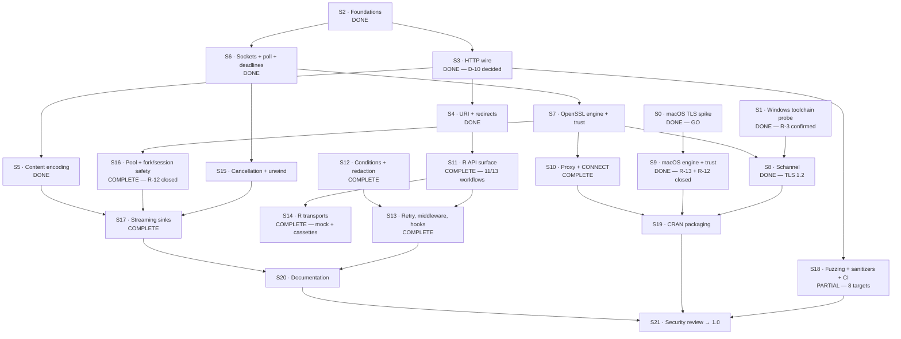

# zuhttp Roadmap to 1.0

**Companion to:** [zuhttp-design.md](zuhttp-design.md)
**Status:** Draft
**Last updated:** 2026-09-09 · **Tracks C and D complete but for the S7/S9 cert matrices; S12, S16, S17 complete; S15 explicitly partial. Two TODO items queued: the test-framework hardening plan and the Mbed TLS spike.**
**Total estimate:** 41–48 person-weeks (§64 of the design doc, plus spikes)

---

## How this roadmap is organised

Every stage below is **independently completable and independently verifiable**. The test for whether a stage belongs on this list is:

> Can it be finished, tested, and reviewed without any other unfinished stage existing?

That constraint is what makes the plan parallelisable and what makes a stalled stage survivable. It is achievable here because of one architectural property: **the `zu_stream` interface (§9) sits between the HTTP engine and the network.** The entire HTTP engine — parsing, framing, redirects, decompression, pooling logic — can be built and fully tested against a mock stream feeding canned bytes, with no sockets and no TLS. That decouples Track B from Track C completely, and it is the single most valuable structural decision for delivery speed.

Three rules govern the whole plan:

1. **Spikes before slices.** Stages S0 and S1 answer go/no-go questions and cost days. Everything else is speculative until they land.
2. **A stage is done when its exit criteria pass in CI**, not when the code is written.
3. **No stage may be "mostly done".** A half-finished stage blocks its dependents exactly as much as an unstarted one, but hides it.

---

## Dependency graph



Four tracks run in parallel after S2:

| Track | Stages | Depends on network? | Depends on R? |
|---|---|---|---|
| **A · Spikes** | S0, S1 | yes | no |
| **B · Engine** | S2–S5 | **no** — mock stream only | no |
| **C · Transport** | S6–S10 | yes | no |
| **D · R layer** | S11–S14 | **no** — R transport stub | yes |
| **E · Hardening** | S15–S21 | mixed | mixed |

Tracks B and D are the two that can absorb a second contributor with no coordination cost.

---

## The §63.2 vertical slice — ✅ **COMPLETE**

Before Track D proper, the pieces were wired together end to end, because
everything up to this point had been proven correct **separately** and never
composed. `src/zu_engine.c` plus `zu_get()` in R:

    URL -> TCP -> TLS (verified) -> request -> response -> framing
        -> chunked -> gzip -> one redirect -> memory body -> R raw vector

It worked on the first integration, which is the useful result: the interfaces
the earlier stages were designed against fitted together without rework.

    status=200  bytes=559  tls=TLSv1.3/TLS_AES_256_GCM_SHA384
    class: zu_tls_certificate_error < zu_tls_error < zu_error < error < condition

**What it also forced:** `./configure` (S19 work, pulled forward because
nothing could link OpenSSL from the package build), and `zu_headers_at()` /
`zu_headers_total()` so the R layer can present every field.

**Deliberately not in it:** the pool (one connection per request), proxies,
retries, streaming sinks, and Ctrl-C. Each has its own stage. Wiring them in
before the simple path worked would have made the first integration failure
much harder to read. **Ctrl-C in particular is listed as a §63.2 capability
and is NOT delivered** — it needs `R_UnwindProtect` (S15), and a bare
`R_CheckUserInterrupt()` in the tick callback would longjmp past live C
allocations.

**Also not yet true to the design:** the slice uses OpenSSL on *every*
platform, including Windows and macOS. D-5 and D-4 call for Schannel and the
system trust store; those are S8 and S9. DESCRIPTION says so explicitly.

**RESOLVED by S8 (2026-09-08): Windows now uses Schannel and HTTPS works.**
What follows is the finding that made D-5 mandatory rather than preferred.

**The OpenSSL shortcut did not work on Windows at all**, which CI established
the moment the slice ran there:

```
Error in zu_get("https://example.com") :
  certificate verification failed for 'example.com':
  unable to get local issuer certificate
```

The package *builds and links* fine under Rtools — the failure is at runtime.
OpenSSL on Windows looks for a CA bundle at a path compiled into the library
which does not exist, and it does not consult the Windows certificate store.
There are no trust anchors, so every certificate fails.

This is D-5's rationale, confirmed by measurement rather than argument:
**HTTPS on Windows requires Schannel (S8), not merely prefers it.** Until S8
lands, Windows can build the package but cannot make an HTTPS request, and
DESCRIPTION and `?zu_get` both say so.

---

## Track A — Feasibility spikes

These gate the architecture. They are days of work and must happen **first**. Building engine code before S0 answers is not wasted (Track B is TLS-agnostic), but building any TLS code before it is.

### S0 · macOS TLS spike — ✅ **COMPLETE 2026-09-07 · verdict: GO**

**Retired:** Appendix B R-1, the project's highest risk.
**Answered:** Decision D-4 — **Accepted**.
**Actual effort:** under 1 day (estimated 1 week).
**Artifacts:** [`spike/macos-tls/`](../spike/macos-tls/) — [FINDINGS.md](../spike/macos-tls/FINDINGS.md), 16/16 assertions via `make test`.

Build ~200 lines that:

- open a TLS 1.3 connection to a real host,
- evaluate the chain with `SecTrustEvaluateWithError` against the system Keychain,
- drive the handshake and one request/response from a **synchronous non-blocking poll loop**,
- use **no background thread** and touch no R API.

**Exit criteria**

- [x] Connects to at least 5 real hosts — TLS 1.3, `trust=SecTrust:yes`.
- [x] Custom root honoured — proven via `SecTrustSetAnchorCertificates` without touching the developer's Keychain.
- [x] Expired / wrong-hostname / unknown-issuer rejected with distinguishable, human-readable errors.
- [x] Handshake completes non-blocking with the caller owning `poll()` — 3 checkpoints, longest block 12.9 ms at a 100 ms tick.
- [ ] **Peak thread count is 1** — ❌ **failed: 1 → 3.** Security.framework opens an XPC connection to `trustd`. This turned out to matter far more than expected (F-5).

**Findings that changed the plan**

| | Finding | Effect |
|---|---|---|
| F-1 | Secure Transport has no `kTLSProtocol13` | the fallback is **TLS 1.2-only**, not merely deprecated |
| F-3 | `SSL_VERIFY_NONE` silently accepted every bad cert | negative cert tests mandatory from day one (§50.5; S7, S8, S9) |
| F-4 | Revocation **not** checked by default; enabling costs 7–15× and makes an uninterruptible network call | §14.5 was wrong; corrected. New D-31 |
| F-5 | **`SecTrustEvaluateWithError` does not survive `fork()`** — child SIGSEGVs | **new risk R-12**; S16 scope grows; new D-32 |
| F-6 | `SecTrustSetAnchorCertificatesOnly` gives both `ca_file` and `ca_extra` semantics | §14.2 confirmed implementable; unblocks CI trust testing |

**New work created:** S16 must guard the trust evaluator, not just the pool. S9 must resolve which portable engine is CRAN-viable on macOS (R-13) — the spike used Homebrew OpenSSL, which is not a shippable answer.

### S1 · Windows toolchain probe — ✅ **COMPLETE 2026-09-07 · R-3 CONFIRMED**

**Outcome:** Appendix B R-3 confirmed, not retired.
**Actual effort:** ran on CI; no Windows machine needed.
**Artifacts:** [`spike/windows-schannel/`](../spike/windows-schannel/) — [FINDINGS.md](../spike/windows-schannel/FINDINGS.md), job `windows-s1` in `tls-spike.yaml`.

**Exit criteria**

- [x] Exact set of missing declarations documented: `SCH_CREDENTIALS` and `TLS_PARAMETERS` typedefs absent; the TLS 1.3 *macros* are present.
- [x] TLS 1.2 fallback path confirmed to compile; SSPI and CryptoAPI confirmed to link and run.
- [x] Decision recorded — see below.

**Verdict.** Rtools' mingw-w64 11.0 `schannel.h` is incomplete for TLS 1.3. This is **not** a version gate: `-D_WIN32_WINNT=0x0A00` does not make the typedefs appear. Because the constants already exist, only two structures need declaring locally (~30 lines).

**New work created (S8):** declare `SCH_CREDENTIALS` and `TLS_PARAMETERS` behind a feature guard, **and verify their ABI on a real Windows 10+ target** — a wrong layout passed to `AcquireCredentialsHandle` is a memory-safety bug, not a compile error. If the ABI cannot be verified confidently, ship Windows TLS 1.2-only for v1 (new open question §62.1 Q2a).

---

## Track B — Engine (no network, no R)

The whole track is testable through the mock stream. It needs no TLS backend, no sockets, and no R session. This is where the parser and URI decisions (D-10, D-11) got made by measurement rather than argument — both are now settled.

### S2 · Foundations

**Effort:** 1.5 weeks. **Depends on:** nothing.

Checked growable buffer; `zu_alloc`/`zu_realloc`/`zu_free` with overflow checks (§41); the `zu_error` type and code registry (§34.2); monotonic clock shims (§24.4); the `zu_stream` vtable (§9); and the **mock stream** (§50.1) that replays a byte script with configurable chunk boundaries and injectable errors.

**Exit criteria**

- [ ] Mock stream can deliver any byte sequence split at any boundary, including one byte at a time.
- [ ] Allocator rejects every overflow case in its test matrix.
- [ ] Builds standalone with no R headers — this is what makes S18 possible.

### S3 · HTTP wire

**Effort:** 3 weeks. **Depends on:** S2.

Request builder with header-injection rejection (§17.1); default headers (§17.2); response parser wrapper; **strict framing** (§18.1); chunked decoding with trailers (§18.2); duplicate-header container (§18.3); header limits enforced pre-parse (§18.4).

Implement against a thin parser interface and build **both** picohttpparser and llhttp behind it. This stage decides D-10.

**Exit criteria**

- [x] Every row of the §18.1 framing table is a passing test.
- [x] Obsolete line folding, malformed status lines, and invalid header names rejected.
- [x] Chunked decoding with trailers, truncation, malformed chunk sizes, and a bounded decoded total.
- [x] **D-10 decided and recorded: picohttpparser** (803 LOC, MIT, commit `f4d94b4`).
- [ ] The full §50.3 malformed corpus — a broader corpus lands with S18 fuzzing.

**Note on how D-10 was settled.** The strictness layer was built *before* the parser was chosen, which changed the terms of the decision: Appendix A.3's case for llhttp rested on ~800–1,200 lines of framing code being an unpaid cost. With `zu_framing.c` written and tested first, that cost was already incurred, and the comparison reduced to 803 vendored LOC versus ~8,000 for a parser whose remaining job is splitting a status line and a header block.

**Standing consequence:** picohttpparser rejects no smuggling attempt on our behalf. `zu_framing.c` is the only thing that does, which makes it the primary S18 fuzz target rather than a secondary one.

### S4 · URI and redirects

**Effort:** 2.5 weeks. **Depends on:** S3.

RFC 3986 parsing and relative resolution; IPv6 literals; query encoding (§8.2); redirect method/body rewriting (§19.1); cross-origin header stripping (§19.2); downgrade policy (§19.3); chain-wide limits (§19.4); sink isolation (§19.5).

**D-11 resolved: a parse/resolve/recompose SUBSET of uriparser 0.9.8** (8 `.c`
files, ~3.9k code lines), behind the flat `zu_uri` struct, with the client
policy layer in `zu_uri.c`. The subset was derived by linking, not by reading
includes; `tools/update-uriparser` re-derives it on every refresh and fails if
upstream adds a dependency edge. Six of uriparser's eight historical CVEs are
in files the subset excludes — see `src/vendor/uriparser/VENDOR`.

**Exit criteria**

- [x] Passes an RFC 3986 §5 reference resolution test vector set (§5.4.1 normal
      examples and the §5.4.2 abnormal `..`-above-root cases).
- [x] Every row of the §19.1 rewrite table is a passing test.
- [x] Credentials verifiably stripped on scheme, host, **and port** change.
- [x] Redirect bodies never reach the sink.
- [x] Non-ASCII hostnames rejected with a clear error (D-14).
- [x] **D-11 decided**, with the real LOC recorded against the §51.3 budget
      (3.9k, not the 15k the design had carried for two drafts).
- [x] Parser allocates through `zu_alloc`: 0 of 400 OOM injection points leak.
- [x] Port 65536 rejected rather than truncated; empty DNS labels rejected;
      embedded NUL rejected; input parsed as a byte range, not a C string.

### S5 · Content encoding

**Effort:** 1 week. **Depends on:** S3.

System zlib linkage; gzip/zlib auto-detection; raw-deflate fallback (§21.3); incremental enforcement of `max_decompressed_bytes` and `max_decompression_ratio` (§21.4).

**Exit criteria**

- [x] Both `deflate` wrappings decode (zlib-wrapped and raw), decided from the header signature.
- [x] A real bomb — 400 KB of zeros under 2 KB compressed — fails on the output cap with bounded allocation, and again on the ratio cap.
- [x] A legitimate high-ratio body under both caps still succeeds.
- [x] `Transfer-Encoding: gzip` rejected in `zu_framing` per §18.1.

---

## Track C — Transport

### S6 · Sockets, poll, deadlines

**Effort:** 2 weeks. **Depends on:** S2. **Blocks:** S7, S15.

Non-blocking sockets on POSIX and Winsock; `poll`/`WSAPoll` loop; the deadline composition rule (§24.2); DNS via `getaddrinfo` with the documented non-interruptibility gap (§8.4).

**Exit criteria**

- [x] `effective_deadline = min(now + phase, request_deadline)` holds under test.
- [x] A stalled read ends at the deadline rather than blocking, verified by
      elapsed time. **This was ticked prematurely.** It held on macOS and
      Windows; on Linux `zu_now_ms()` returned 0 forever (see below), so no
      deadline expired and this test hung instead of passing. Re-verified on
      all three platforms as of 28fe55d.
- [x] The tick callback fires at the configured cadence and can cancel a stalled read — this is the seam where `R_CheckUserInterrupt()` lands at S15, and it is why the core needs no R headers to be interruptible.
- [x] Refused connection, unresolvable host, and orderly close each produce the right code and phase.
- [x] Monotonic clocks only; a wall-clock change cannot move a deadline.
- [x] **The clock is not merely monotonic but actually advances.** Added after
      the fact: `src/zu_time.c` lacked the `_POSIX_C_SOURCE` preamble, so
      `-std=c99` hid `CLOCK_MONOTONIC` on glibc and `zu_now_ms()` fell through
      to `return 0`. Every timeout in the library was inoperative on Linux.
      suite_time asserted the clock was *monotonic*, which a constant
      satisfies, so it passed for six commits while the Linux C jobs hung.
      The fallback is now a build error, the suite asserts the clock advances
      and that a short deadline expires, and `tools/check-feature-macros`
      (run in CI) prevents a third instance of the class.
- [ ] Inactivity timers reset on progress — arrives with the engine loop, which has no caller yet.

### S7 · OpenSSL engine and trust

**Effort:** 2 weeks. **Depends on:** S6.

The reference implementation of the §13.1 engine/trust split. Hostname verification via `X509_VERIFY_PARAM_set1_host` — never hand-rolled. `ca_file`/`ca_data`/`ca_extra` semantics (§14.2). Pinning (§14.4).

**Exit criteria**

- [ ] The full §50.5 certificate matrix passes with distinguishable condition
      classes. **Seven of the eight rows pass as of 2026-09-08**
      (`test-certs.R`), against locally generated certificates served by
      `openssl s_server` on loopback — no Keychain is touched and nothing
      reaches the internet, which §50.5 requires. Trusted, unknown issuer,
      wrong hostname, expired, not-yet-valid, `ca_file` as a replacement and
      `ca_extra` as an addition all behave, and the classes are genuinely
      distinguishable: a hostname mismatch raises `zu_tls_hostname_error` and
      *not* `zu_tls_certificate_error`, because the two have different fixes.

      **Unticked for the eighth row: pin match/mismatch.** See the pinning
      criterion below.

      Verified against the bug it exists for. S0's finding F-3 was a build
      that accepted *every* invalid certificate while looking perfectly
      healthy; simulating it — forcing `verify_peer = 0` in the engine — fails
      **10 assertions** across the matrix. The file also carries a row that
      must SUCCEED, because a client that rejected everything would otherwise
      satisfy every negative test in it.
- [x] `ca_extra` adds to system trust; `ca_file` replaces it. Both proven by
      test — **2026-09-08**, once §14 became reachable from R at all. The same
      locally generated CA is supplied both ways, so the only variable is
      which argument it went to: `ca_extra` and a public host still
      validates; `ca_file` and the same host is rejected. That is §14.3's
      claim stated as a test rather than as prose.
- [ ] **`zu_tls(revocation = TRUE)` is unusable on this backend.** Found by
      CI 2026-09-10, not by review: `zu_tls_openssl.c` sets
      `X509_V_FLAG_CRL_CHECK | CRL_CHECK_ALL` and configures no CRL source,
      and OpenSSL neither downloads CRLs nor performs OCSP — so the flag
      fails *every* chain, valid ones included, with "certificate verify
      failed". It fails closed rather than accepting a revoked certificate,
      so it is not a security hole; it is a documented option that cannot do
      what it says. The suite now skips the affected arms naming this
      criterion, and `?zuhttp_tls` and the README say so. Fixing it means a
      CRL source or OCSP, which is a design question §14.5 has not answered.
- [ ] Pin match and mismatch both behave, and pinning does not bypass chain
      verification. **Reachable from R as of 2026-09-08** (`zu_tls(pins = )`),
      and asserted to never silently do nothing: a build either enforces the
      pin or raises `zu_tls_pin_error`, and a *successful* response to a
      pinned request is a test failure. Match/mismatch against a real pin
      still needs the §50.5 local server. On macOS the backend refuses to pin
      at all, deliberately — Security.framework will not yield the
      SubjectPublicKeyInfo without hand-parsing DER, and "a pin that silently
      checks the wrong bytes is worse than no pin" — so this criterion cannot
      be ticked there without reversing that decision.

### S8 · Schannel — ✅ **COMPLETE 2026-09-08 (TLS 1.2)**

**Estimated:** 4–6 weeks, "the largest single line item in the plan and the
lowest-confidence estimate". **Actual:** ~570 lines, nine CI rounds.
**Retires:** Appendix B R-2 — the size fear did not materialise.

`src/zu_tls_schannel.c`. SSPI for the protocol, `CertGetCertificateChain` +
`CertVerifyCertificateChainPolicy` for trust, with
`SCH_CRED_MANUAL_CRED_VALIDATION` so §13.1's split holds. Verified on CI:

```text
status 200 tls TLSv1.2 bytes 559
expired    -> zu_tls_certificate_error
wrong host -> zu_tls_hostname_error
```

**Exit criteria**

- [x] Same §50.5 matrix as S7, same condition classes — 21 C-level checks plus
      the R-level slice.
- [x] **LOC measured as written: ~570**, against a 3,500 escalation threshold.
      The estimate was out by roughly 6x, and the reason is worth recording:
      the estimate assumed renegotiation and `ApplyControlToken` shutdown,
      neither of which a client doing HTTP/1.1 needs.
- [ ] Additive custom CA through an in-memory store (§14.3). **Not
      implemented.** Configuring `ca_file`/`ca_data`/`ca_extra` on Windows
      raises an error rather than silently ignoring the setting and using
      system trust anyway.
- [ ] TLS 1.3. Needs `SCH_CREDENTIALS`, still absent from Rtools45/GCC 14.3
      (R-3, re-confirmed 2026-09-08). A toolchain bump will not fix it.

**What it cost, and why.** Nine CI rounds with no Windows machine in the loop.
Four found real defects: a constant that lives in `wininet.h`, a
`SECBUFFER_EXTRA` underflow that was the actual segfault, an uninitialised
`inb` read found by reading rather than testing, and an `R_FindNamespace`
PROTECT bug that predates S8 and affected all three platforms.

The other five were spent on a crash that did not exist: a multi-line
`Rscript -e` argument fails on Windows before executing anything, and
`continue-on-error` on the diagnostic steps turned their green ticks into
noise I mistook for evidence. **Every R check in CI now runs from a file, and
diagnostic steps that are meant to inform a decision must not carry
`continue-on-error`.**

### S9 · macOS engine and trust

**Effort:** 3–5 weeks. **Depends on:** S0 ✅.

Implements the S0-validated design: portable engine + `SecTrustEvaluateWithError`. `spike/macos-tls/tls_spike.c` is the working reference for the handshake pump, the `cert_verify_callback` → SecTrust bridge, and anchor handling.

**Exit criteria** — S7's, plus the three the spike created:

- [ ] Same §50.5 matrix as S7, same condition classes. Seven of eight rows
      pass here too — `test-certs.R` is backend-agnostic and runs against
      whichever backend the build linked, so S7 and S9 are covered by the same
      file rather than by two that drift. Two of this backend's answers are already asserted from R:
      TLS 1.3 is **refused rather than downgraded** (S0 finding F-1: Secure
      Transport has no `kTLSProtocol13`, and silently giving a caller 1.2 when
      they asked for 1.3 is weakening a security setting), and pinning refuses
      rather than pretending.
- [ ] **A CRAN-viable engine is identified and building** (R-13). Homebrew OpenSSL is not an answer; this is the stage's real risk, not the TLS code.
- [ ] `SSL_VERIFY_PEER` set, with a test proving an invalid certificate aborts the handshake (F-3).
- [ ] `zu_tls(revocation = TRUE)` works and is off by default (F-4). **Half
      closed 2026-09-10** (test-hardening A1): "off by default" is asserted
      against `revoked.badssl.com`, and the flag demonstrably changes the
      outcome. "Works" is not shown and cannot be shown against badssl.com on
      this backend — a valid certificate from the same CA fails identically,
      because Let's Encrypt no longer answers revocation queries. Needs a
      locally generated revoked certificate, alongside the §50.5 matrix.

### S10 · Proxy and CONNECT — ✅ **COMPLETE 2026-09-08**

**Effort:** 2 weeks. **Depends on:** S7.

Environment parsing including the lowercase-only `http_proxy` rule (§20.1); `NO_PROXY` matching on label boundaries (§20.2); absolute-form requests; CONNECT tunnelling parsed with full §18 strictness; Basic proxy auth with the §20.4 leakage rules.

`zu_proxy.{h,c}`. The environment is read through a seam rather than by
calling `getenv()` directly, so the §20.1 and §20.2 rules are tested against a
table — mutating the real environment is not thread-safe, leaks between tests,
and cannot express "unset" reliably on Windows.

**Exit criteria**

- [x] `NO_PROXY` matches `api.example.com` for `example.com` but not
      `notexample.com`. Also: `*`, leading dots, ports (`example.com:8080`),
      bracketed IPv6 with a port, case-insensitivity, and IP literals matching
      exactly rather than by suffix — without which `1.2.3.4` would bypass the
      proxy for the unrelated host `10.1.2.3.4`.
- [x] Proxy URL credentials are moved out of the URL at parse time and
      percent-decoded, so `p%40ss` authenticates as `p@ss` rather than being
      sent literally.
- [x] A non-2xx CONNECT surfaces the proxy's status; 407 is a distinct
      `zu_proxy_auth_error`. CONNECT responses are parsed with full §18
      strictness — a proxy is not exempt, and a lenient parse there is a
      tunnel built on a lie.
- [x] `Proxy-Authorization` is generated only inside
      `zu_proxy_connect_request()`, i.e. only on the connection to the proxy.
      **The "provably never reaches an origin, including across a redirect"
      half needs the request engine (S11+) to be provable end-to-end**; at
      this layer there is no code path that could add it to an origin request.
- [x] `http_proxy` is honoured but `HTTP_PROXY` is ignored (httpoxy, §20.1).

**Unblocked and finished 2026-09-08.** The engine now drives it: the proxy is
resolved per hop, plain HTTP goes out in absolute-form with
`Proxy-Authorization`, HTTPS tunnels through CONNECT, and the §26.1 pool key
carries proxy identity including credentials so two clients with different
proxy credentials cannot share a tunnel.

The deferred half of criterion 4 — *"provably never reaches an origin,
including across a redirect"* — is now structural rather than asserted. The
proxy is re-resolved for every hop, so a redirect onto a `NO_PROXY` host never
reaches the branch that adds the header. `test-proxy.R` observes the actual
bytes the engine sends by running a **real minimal proxy in a helper process**
on loopback: that is the only way to assert "the request line was
absolute-form" or "the credential was present, decoded, and confined to the
proxy" rather than inferring it from a request having succeeded. It asserts
the request line contains no `@` at all — neither the origin's userinfo nor
the proxy's.

`proxy = FALSE` disables proxying; **not `NULL`**, which §31.9 already owns.
See D-48 and the correction in §20.1.

Verified non-vacuously: disabling the absolute-form branch fails both the
request-line and the credential test.

---

## Track D — R layer

Buildable against an R-level transport stub before any C transport exists.

### S11 · R API surface — ✅ **COMPLETE 2026-09-08**

**Effort:** 3 weeks. **Depends on:** S4.

`zu_client()`, `zu_request()`, method helpers, `zu_perform()`; the single-signature rule with `client =` always named (§31.3); configuration merging (§31.9) including `NA` removal and `NULL` reset; request and response printing; accessors (§31.7) including charset handling and the `jsonlite`-in-Suggests decision.

Three decisions the design had left open were resolved here and written back to
it: **D-33** `check = TRUE` by default, **D-34** `base_url` is joined rather
than RFC 3986-resolved, and **D-35** the three-state policy merge that the
`NULL`-resets rule turns out to require (absent, `NULL`, value — `missing()`
plus a reset sentinel, because an R list cannot hold a `NULL` as a value).

The C side grew three things the R surface needed: `ZU_ERR_HTTP_STATUS` and its
4xx/5xx children, so `zu_resp_check()` raises §34.1 classes from the one
class-chain definition in C rather than a second table in R; a `no_decode`
option behind `decode = FALSE` (§21.2), which also sends
`Accept-Encoding: identity` — a caller asking for wire bytes wants the server
to stop encoding, not just for us to stop decoding; and `decode` as an
eleventh argument to `C_zu_perform`.

**Exit criteria**

- [x] All 13 workflows in §31.16 run against the stub transport. **11 of 13.**
      Workflow 5 (retry) and workflow 6 (streaming download) belong to S13 and
      S17 and have no implementation to exercise; both are `skip()`ped by name
      in `test-workflows.R` rather than omitted, so the gap is visible in the
      test output instead of looking like coverage. The other eleven pass,
      including `mclapply` (11) and `saveRDS` in a genuinely new session (12).
- [x] `library(httr2); library(zuhttp)` produces zero masking warnings —
      verified by loading both, and by `test-naming.R` intersecting the two
      live export lists. httr2 is deliberately NOT in `Suggests`: that would
      make CRAN install it and its dependency chain to run one naming guard,
      so the assertion runs wherever httr2 happens to be installed and skips
      by name where it is not.
- [x] Charset fallback chain behaves for a server sending no `charset`:
      all five steps of §31.7 tested, including the BOM branch and the
      `application/json` short-circuit. Latin-1 bytes with no `charset` raise
      `zu_body_decode_error` rather than decoding to mojibake.
- [x] JSON helpers give a clear, actionable error when `jsonlite` is absent;
      everything else works — tested by mocking the check away, including a
      full POST of a caller-serialised JSON string with no `jsonlite` present.

**Also done here:** the §42.4 canary now covers printed requests and the
request/response a condition carries (S12's criterion was explicitly waiting on
this stage). What remains uncovered there is verbose transport logging and
recordings, S14/S35.

### S12 · Conditions and redaction — ✅ **COMPLETE 2026-09-08**

**Effort:** 1.5 weeks. **Depends on:** S2 (for codes). Otherwise independent.

The full §34.1 hierarchy in base R; the §34.2 payload; §34.4 message quality; the §42 redaction filter applied at every egress.

**This is the first R code in the package.** `R/conditions.R`, `R/redact.R`,
and the first `.Call` entry points in `src/init.c`.

Two things are deliberately in C rather than R, both for the same reason —
one definition:

- the §34.1 class chain (`zu_code_class_chain`). Catching `zu_tls_error` must
  also catch `zu_tls_certificate_error`, and a parent map kept separately in R
  would drift from the C enum the first time a code was added.
- the §42 redaction policy (`zu_redact.c`). §42 opens by requiring one policy
  at every egress; a second implementation in R would be a second thing to
  forget to update.

**Exit criteria**

- [x] Every class catchable by base `tryCatch()` with no extra package —
      tested by iterating the whole code registry, not a sample.
- [x] Catching a parent catches its children, and a sibling is not caught.
- [x] A redacted request is still executable (§42.3): redaction is applied by
      the formatting layer, and `zu_redact_headers_for_display()` is verified
      not to mutate its input.
- [x] The §42.4 canary test finds no credential in verbose output, printed
      objects, error payloads, hook payloads, or recordings. **Closed
      2026-09-08.** Conditions, displayed headers, URLs, form bodies,
      printed requests and responses, and the request/response stored on a
      condition are covered (the last three added by S11); **recordings joined
      them in S14**, asserted at the byte level on the cassette file.
      Verbose transport logging was the last gap and is now covered:
      `zu_verbose()` is built on §35.3 hooks, whose payloads are redacted
      before any handler runs, so a trace cannot carry a credential — not
      because the tracer is careful but because it never receives one. A
      parallel logging path would have needed its own redaction, which is the
      second implementation §42 opens by warning about. `zu_info()` was added
      to the canary at the same time, since it exists to be pasted into bug
      reports and a proxy URL routinely carries a credential.

      **This arm was half true when it was ticked, and the missing half was
      a live leak.** It ran over a mock transport, where there is no engine
      and so no §35.3 event log at all — so it said nothing about
      `zu_get(url, trace = TRUE)`, which printed the request URL through
      `zu_verbose()` with its userinfo and `?access_token=` intact. "The
      payload is redacted before the handler runs" was true of the four
      HTTP-level hooks and false of the trace, which R reads from the
      response rather than receiving. Closed by redacting in the engine
      (D-51); the arm now drives the real engine against a loopback origin,
      which is what makes it able to fail.

      **A second entry in the same list was never written at all.**
      `zu_resp_url` has been in the covered vector since S11 with no arm
      behind it — the nearest one exercises `zu_redact_url()`, the function,
      not the accessor. It would have failed: the final URL was built by a
      function that omits userinfo, so "credential-free" covered half of
      §42.1 and a `?access_token=` came back live (D-52). Two entries out of
      one list, one vacuous and one absent, under a comment that says a new
      egress means a new arm and a new line here. The list is what needs a
      guard, not the egresses.

      **The R suite now has zero `skip()`s.**

      **Hook payloads joined the canary in S13.**

      §42.4 calls this "a regression class that reappears every time a new
      output path is added", so the arms are now enumerated in a test rather
      than remembered — a new egress means a new arm and a new line there.

      Two arms of this canary turned out to be **vacuous**, both found by
      stages that came later. S14: it asserted a form body's `client_secret`
      did not appear in a printed request, but the printed form never renders
      the body. S13: `expect_no_canary()` walked one level and leaned on
      `print()`, so a nested payload was checked only through a rendering that
      had already redacted it. Both fixed; the helper now walks to any depth.
      The lesson is the one §50 already states — a canary that cannot fail is
      worse than no canary, because it is counted as coverage. Two of them
      here were, for months.

### S13 · Retry, middleware, hooks — ✅ **COMPLETE 2026-09-08**

**Effort:** 2 weeks. **Depends on:** S11, S12.

Policy/middleware split (§31.13); retry admissibility (§33.1); the §33.2 condition table; backoff with jitter, clamped `Retry-After`, budget checks before sleeping, interruptible sleeps; hook events (§35.3).

`zu_retry()`, `zu_req_retry()`, `zu_req_replay_safe()`, `zu_body_rewindable()`,
`zu_hooks()`, and `middleware =` on the client. The retry loop lives in R,
above the transport, so a retry re-runs the whole transport call — which is
what makes every test below offline.

**Exit criteria**

- [x] A POST is never retried without explicit opt-in or an idempotency key.
      All six idempotent methods retry; POST does not; `replay_safe = TRUE`
      and an `Idempotency-Key` header each enable it. Admissibility is decided
      once, before the first attempt, rather than re-derived per failure.
- [x] A non-rewindable body raises `zu_body_not_replayable` rather than
      truncating — and raises it **before any attempt**, since discovering it
      only on the first failure would make it intermittent. No public API
      builds a non-rewindable body yet (§28.2's connection and callback rows
      are S17), so the test sets the marker directly; what it asserts is the
      mechanism S17 will hand a real body to.
- [x] `zu_get(url, timeout = 30)` with 3 retries returns within 30s (§24.3).
      Tested from both sides: a budget that cannot fit the backoff returns
      immediately, **and** a backoff that does fit is actually slept — the
      first assertion alone would be satisfied by never sleeping at all.
- [x] Backoff sleep responds to Ctrl-C. **S15 records that this harness cannot
      test cancellation; for a blocking read in C that is true, but a backoff
      sleep is R-level and can be tested honestly.** A helper process parks in
      a 60-second backoff, the test delivers `SIGINT`, and the process reacts
      in well under a second. Non-vacuous: suppressing the signal fails it.

**Two findings while doing this.**

An early draft of `retry_sleep()` carried an `interrupt_pending()` that always
returned `FALSE` — a checkpoint that checked nothing, reading as a mechanism
without being one. Removed. Ctrl-C responsiveness comes from `Sys.sleep()`
itself; the slice loop exists for the **deadline**, so that a budget expiring
*during* a long backoff cuts the wait short. Saying which property comes from
where is the difference between a comment and a claim.

**S12's canary had a second vacuous arm**, found when the new hook-payload arm
passed with the redaction filter commented out. `expect_no_canary()` walked
one level and leaned on `print()`; a hook payload is
`list(request = <zu_request>, …)`, the request is not atomic so the one-level
`unlist()` skipped it, and `print.zu_request()` redacts on the way out — so
the canary was inspecting the redacted *rendering* of the value it was meant
to check. The helper now walks to any depth. That strengthens every existing
arm, and all of them still pass.

### S14 · R transports — ✅ **COMPLETE 2026-09-08**

**Effort:** 1 week. **Depends on:** S11.

`zu_native_transport()`, `zu_mock_transport()` with method/URL/header/body matching, and record/replay with §37 redaction and a `tempdir()` default.

Delivered as `zu_stub()` + `zu_mock_transport(...)` for matching, and
`zu_cassette_transport(dir, name, mode)` for record/replay, with
`zu_cassette_interactions()` and `zu_cassette_clear()` to inspect and delete.
See §37.1 for the three decisions (D-39, D-40, D-41).

**Exit criteria**

- [x] A downstream package's test suite runs fully offline. All 63 checks in
      `test-record.R` run with no network — deliberately, since a stage whose
      criterion is "runs offline" cannot prove it with a test that needs a
      server. Where a "real" transport is needed, a `zu_mock_transport()`
      plays that part; §36.1 makes that faithful, because a transport
      implements network semantics only and everything above it (merging,
      redirects, redaction) is the same code either way. `mode = "replay"`
      holds no underlying transport at all, so a cassette miss cannot silently
      fall through to the network.
- [x] A cassette contains no credential. Asserted at the **byte** level on the
      file itself (`grepRaw`), not on the parsed interaction — the latter
      would only prove the accessors redact. Non-vacuous: removing the header
      redaction from `redacted_request()` fails it.

**Found while doing this, and worth reading.** Closing the second criterion
turned up two defects, one of them in shipped code:

1. §42.1's default parameter list was too narrow for this egress — a form body
   of `client_secret=` or `password=` reached the disk in plaintext. Fixed by
   extending the shared C policy (D-39), so URLs, printed objects and
   conditions gained the same protection.
2. **S12's canary had a vacuous arm.** `test-redact.R` asserted that a form
   body's `client_secret` did not appear in a printed request — but
   `print.zu_request()` renders `Body: form, 63 bytes` and never the bytes, so
   that assertion held whether or not `zu_redact_form()` worked. It claimed
   coverage of an egress it did not touch. Replaced with an assertion against
   something that really renders the body.

---

## Track E — Hardening and release

### S15 · Cancellation and unwind — **PARTIAL, and honestly so**

**Effort:** 2 weeks. **Depends on:** S6.

External-pointer ownership as the invariant, `R_UnwindProtect()` as the
enforcement (§25.2); the interrupted-connection rule (§25.3);
`R_ProcessEvents()` on Windows front-ends (§25.4).

Implemented in `src/init.c`: a checkpoint every ~100 ms that never lets a
longjmp cross a C frame holding native state. The tick does **not** call
`R_CheckUserInterrupt()` directly — that does not return when an interrupt is
pending, it longjmps past every frame between it and the enclosing `tryCatch`,
abandoning sockets, TLS contexts and buffers. Instead `R_ToplevelExec` runs the
check at a frame where nothing of ours is live and reports whether it jumped;
the tick then returns 1 and the engine unwinds through its own error paths.
`R_UnwindProtect` wraps the response construction so C memory is released
promptly rather than at the next GC.

**Exit criteria**

- [x] An interrupted connection is never pooled — the slice opens and closes
      one connection per request, and §26.3's `ZU_NOREUSE_CANCELLED` already
      forces a close.
- [x] The checkpoint fires at the §25.1 cadence: measured at 100 ticks over a
      10 s request, i.e. every ~100 ms, which is the design's ceiling.
- [ ] **Ctrl-C cancels within 200 ms on all three front-ends. NOT VERIFIED.**
- [ ] Interrupt at every phase leaks zero descriptors under ASan and valgrind.
      Blocked on the same thing.

**Why the Ctrl-C criterion is unverified, and what would verify it.** A
backgrounded `kill -INT` does not reach R's interrupt flag while R is inside a
`.Call` in a non-interactive session — `R_interrupts_pending` stays 0 for the
whole request, whether the signal targets the pid or the process group.

That is a property of the harness rather than of this code, established by
control experiment: the `curl` package, which has working Ctrl-C and uses the
same `R_ToplevelExec` idiom, **also completes normally** under the identical
harness. Two `expect`-driven pty attempts produced unusable output.

Manual procedure, until an automated one exists:

```r
# in an interactive terminal R
library(zuhttp)
zu_get("https://httpbin.org/delay/30")   # press Ctrl-C within a second
# expect: zu_interrupted_error, promptly, and the session still usable
```

Repeat in Rgui and RStudio for §25.4, where delivery goes through the event
loop and `R_ProcessEvents()` is what makes it observable.

**Found by this stage.** `R_UnwindProtect` was being passed `R_NilValue` as its
continuation token. R checks `cont == NULL`, and `R_NilValue` is a perfectly
valid SEXP, so it passed that check and was then used as a continuation it is
not — failing with `bad value` on **every single request**, and looping until
it had produced 2 GB of error output. Caught immediately because it broke the
normal path, not the interrupt path.

### S16 · Connection pool — ✅ **COMPLETE 2026-09-08**

**Effort:** 2 weeks. **Depends on:** S7. **Status: ✅ COMPLETE 2026-09-08** — all six criteria.

Pool key by value (§26.1); policy and stale detection (§26.2); the no-reuse rules (§26.3); **PID guard on every acquisition and in every finalizer** (§26.4); lazy pool re-creation after deserialization (§26.5).

`zu_pool.{h,c}` depends on `zu_stream` only — not on TLS or sockets — so the
whole pool is tested on the mock stream with no network. §26.2 stale detection
needed a liveness probe the stream interface did not have, so `readable()` was
added to the vtable and implemented for TCP (`poll` for `POLLIN`), TLS
(`SSL_pending` first, then delegate) and the mock (scripted, overridable).

The §26.4 guard lives in `zu_fork.{h,c}` rather than inside the pool, because
§26.4 has two hazards sharing one mechanism and hazard 2 is in the trust
evaluator, not the pool.

**Exit criteria**

- [x] Every §26.3 condition provably closes rather than pools — one enum
      member per bullet, all seven tested.
- [x] Two clients with identical config share a pool; two with different TLS
      config do not. Tested by walking **every** field of the §26.1 key in
      turn, so a coarse key fails the suite rather than being assumed absent.
- [x] A real `fork()` drops inherited connections without a graceful close,
      re-arms the guard, and leaves the parent's connection intact. Verified
      non-vacuous: breaking the guard makes the test fail.
- [x] On macOS, HTTPS in a forked child raises `zu_fork_error` with an
      actionable message — **and does not crash the worker** (R-12). Closed
      2026-09-08 by `tests/testthat/test-fork.R`, once S9 shipped the Secure
      Transport backend that gave the guard something to protect. **R-12 is no
      longer the project's top unmitigated risk.** Verified non-vacuously in
      the strongest available sense: disabling the `zu_fork_guard_tripped()`
      branch in `zu_tls_sectransport.c` reproduces F-5 exactly — the worker
      dies with `caught segfault, address 0x110, cause 'memory not mapped'`
      and its `mclapply()` element comes back `NULL`. A second test proves a
      child tripping the guard does not disarm the parent. `tools/ci-fork-guard.R`
      is the CI gate and fails on a *skip* as well as on a failure, so a build
      on the wrong backend cannot turn the check green by not running it.
- [x] A pooled client used inside `parallel::mclapply()` corrupts nothing and
      drops inherited connections. Closed 2026-09-08. Each child reports
      `forks_detected = 1`, `discarded_fork = 1` and `hits = 0` — it saw the
      fork, dropped the inherited socket and did **not** reuse it — while the
      parent's own connection stays idle and is reused afterwards. Tested over
      plain HTTP on purpose: on macOS hazard 2 (R-12) would abort the child
      before hazard 1 could be observed, and hazard 1 is what this criterion
      is about.
- [x] A client survives a `saveRDS()`/`readRDS()` round-trip into a fresh
      session (§26.5). Closed 2026-09-08. The restored client's external
      pointer is a live SEXP with a NULL address; `C_zu_pool_valid` says so,
      and the next request lazily builds a new pool from the retained
      configuration. The test asserts the stale pointer is *present and
      invalid* rather than only that a request works, which is what stops it
      passing for a client that carries no native state at all.

**What closing these took (D-36, D-37, D-38).** `zu_pool.{h,c}` was complete
and unit-tested from S16's first half, but nothing called it — the engine
opened and closed one connection per hop by design. So this stage's second
half was engine and R-layer work, not test-writing:

- `zu_get_opts.pool` (NULL keeps the old behaviour, which is what the fuzzers
  and the offline suites still use);
- acquire in `open_stream()`, and a §26.3 `reuse_after()` decision at the
  disposal site, where the framing and response headers that justify it are
  still in scope;
- `zu_pool_key` built from the URI and TLS settings — the fields
  `zu_get_opts` actually carries, with a comment saying that a field added
  there must be added to the key in the same commit;
- an external pointer with a tag and a finalizer, and the §26.5 lazy
  re-creation in `R/pool.R`;
- `zu_pool_stats()` exported (D-38), because without it a pooled client and an
  unpooled one are indistinguishable from R and every test here would be
  vacuous.

Verified non-vacuously: stubbing out `zu_pool_acquire()` fails 5 assertions
across 3 tests, including the parent-side reuse check at the end of the
`mclapply` test.

### S17 · Streaming sinks — ✅ **COMPLETE 2026-09-08**

**Effort:** 1.5 weeks. **Depends on:** S5, S15, S16.

Memory/file/discard/connection/callback sinks; atomic file writes via temp-and-rename (§27.1); callback error handling through `R_tryCatch` with re-signalling (§27.3); the re-entrancy depth guard (§27.4).

`zu_sink` (§27's write function plus a finish/abort lifecycle, since §27.1's
atomicity is not expressible in a write callback alone), `zu_body.c` for the
decode-and-deliver loop, and `path =` / `callback =` on every verb, with
`zu_req_path()` and `zu_req_callback()` as the composable forms. See §27.6 for
D-45, D-46 and D-47.

**Exit criteria**

- [x] 100 MB download with peak RSS under 16 MB over baseline. Measured in the
      offline C suite against a mock stream — a 100 MB response is exactly
      what you cannot ask a real server for on every CI run. **100 MiB to a
      discard sink grows peak RSS by 0 KiB, to a file by 0 KiB, and into a
      memory sink by ~100 MB.** The third is a deliberate control: without it
      the first two are unfalsifiable, because "RSS did not grow" is also what
      a broken measurement reports.
- [x] A callback raising an R error surfaces **the user's** error, not a
      wrapped one, and leaks nothing. `conditionMessage()` is the caller's own
      text and the condition does not inherit `zu_error`; the read loop
      unwinds normally first, so the connection is released rather than
      longjmped past, and the next request on the same client succeeds.
- [x] A nested request on the same client errors clearly rather than
      deadlocking — and a request through a *different* client is
      unrestricted, which is the half that says the guard is not just a
      blanket ban.
- [x] An interrupted download leaves no truncated file at the target path.
      Asserted three ways: abort leaves neither the destination nor the
      temporary file; a sink dropped without abort cleans up too; and a
      failed download does not destroy a file that was already there.

**Two things found while doing this.**

§27.3 says to catch "a condition". Catching the `condition` class outright is
wrong — `warning()` and `message()` signal and then restart, so they never
unwind past C, and swallowing them turns an informational message inside a
callback into a fatal transport error. testthat signals expectations the same
way, so an `expect_true()` inside a callback was caught and re-signalled as an
error; that is how it surfaced. Narrowed to error and interrupt (D-47), and
§27.3 corrected.

And a lazy-evaluation trap in the re-entrancy guard, worth recording because
the symptom pointed nowhere near the cause. The caller writes
`r$callback <- guard_callback(r$callback, st)`, so `f` is a promise for a
binding that is then replaced by the wrapper; unforced, calling the wrapper
resolves `f` to the wrapper and recurses until R's expression depth runs out —
surfacing as "evaluation nested too deeply" from inside a C callback that had
not yet run. `force(f)` is load-bearing, and there is a regression test for it.

### S18 · Fuzzing, sanitizers, CI

**Effort:** 2 weeks. **Depends on:** S3. Can start as soon as the engine builds standalone.

libFuzzer harnesses for the parser wrapper, chunked decoder, header normalisation, URI handling, redirect resolution, proxy env parsing, and decompression limits; ASan/UBSan/MSan builds; `-Wall -Wextra -Wpedantic` and MSVC `/W4` as errors for project-owned code; corpus shared with §50.3.

Each harness builds **two** ways from the same source: with libFuzzer (finds
bugs, needs clang) and with a plain corpus-replay driver (needs nothing, so
the checked-in corpus is a regression suite on every platform including
Rtools, where libFuzzer does not exist).

**Exit criteria**

- [x] All seven §43 targets build and run without R: response, chunked,
      headers, uri, redirect, inflate, proxy. (The seventh landed with S10.)
      An eighth was added with S12 for `zu_redact_url`, which deliberately
      does not use the URI parser — it must work on a URL that failed to
      parse — and so is a hand-rolled scanner over attacker-controlled bytes.
      Its assertion is the security property: no userinfo may survive into
      the output.

      **A ninth, `body`, was added 2026-09-08** for the streaming path S17
      introduced — every response body passes through it, and S17 moved the
      §21.4/§40 limit logic into a streaming loop, which is exactly when a
      limit check drifts. Its assertion is the limit itself: the sink must
      never receive more than `max_body`.
- [x] Warnings-as-errors green on all platforms (already enforced by
      `c-core.yaml`; the fuzz targets add no project-owned code).
- [ ] 24 h per target with zero crashes and zero sanitizer reports. **Partial:**
      45 s per target locally under ASan+UBSan — ~54M executions across seven
      targets, zero findings. The `soak` job in `fuzz.yaml` is scheduled
      weekly at 4 h per target; 24 h is a pre-1.0 run, not a per-push one.

**Found by this stage, not by review**

`zu_inflate` enforced the §21.4 caps by checking *after* appending a 16 KB
inflate chunk, so a 1 MB `max_decompressed_bytes` delivered 1 MB + 16 KB. The
figure a caller sized memory from was therefore not a bound. Fixed by bounding
the zlib output window to the remaining allowance and never delivering past
the cap; `out_total <= cap` is now exact, and there are three regression tests.

**And then the same bug again, one layer out.** The `body` target aborted on
its first seed: `zu_body_read()` checked `written > max_body` at the top of
the loop, i.e. *after* a chunk had already gone to the sink. Reproduced from R
in one line — `max_body = 1024` with `decode = FALSE` handed **1593 bytes** to
a user's callback. The check was firing correctly and far too late; a byte a
caller has already received cannot be un-received, and for a callback sink
there is no abort that takes it back. Moved into `zu_body_pipe_feed()`, which
refuses before writing, so the cap holds for every sink. Regression tests walk
every cap from 1 to 30 across the read boundaries, plus the off-by-one in the
other direction — a body *exactly* at the cap must still be delivered.

That is the same mistake in two different functions, found the same way both
times. It is a strong argument for the §43 rule that every new byte-handling
path gets a target rather than a review.

Two harness assertions were themselves wrong and worth recording, because both
are easy to repeat: asserting a resolved `Location` has no userinfo at all
(an absolute Location legitimately replaces the whole authority, credentials
included — the real invariant is *provenance*), and testing that an origin
string does not contain the userinfo as a substring (libFuzzer found
`http://h@oocd.com:/` in seconds: userinfo `h` occurs inside `http://`). The
correct check is that an origin string contains no `@` at all.

The proxy target then found a second real bug: `zu_uri_parse` accepted
**IPvFuture** literals. RFC 3986 §3.2.2 has
`IP-literal = IPv6address / IPvFuture`, so `http://[v7.xyz]/` and
`http://[veee.0;;;;***UU:]/` are valid URIs and uriparser is right to accept
them — but zuhttp cannot connect to an IPvFuture, and accepting one put `;`,
`*` and `:` into the host string that then reaches `getaddrinfo()` and the
Host header. Now rejected in the §8.2 policy layer.

### S19 · CRAN packaging

**Effort:** 2 weeks. **Depends on:** S8, S9, S10.

POSIX `sh` configure with pkg-config fallback and actionable failure messages (§47.3); `cleanup`; `Makevars.win`; `SystemRequirements`; `inst/COPYRIGHTS` and `cph` roles (§49.2); the `LICENSE` two-line file; `.Rbuildignore` for `fuzz/`.

**Exit criteria**

- [ ] `R CMD check --as-cran`: 0 errors, 0 warnings, 0 avoidable notes on all §52 platforms.
- [ ] Clean install on a machine with no OpenSSL dev package produces the §47.3 message, not a compiler error.
- [ ] Tarball ≤ 2 MB; cold compile ≤ 90 s on one core.
- [ ] No network access in any example, test, or vignette.

### S20 · Documentation

**Effort:** 2 weeks. **Depends on:** S13, S17.

User docs per §55: TLS backend and trust per OS, proxy behavior, timeout semantics, redirect policy, retry safety, streaming, error classes, differences from `curl`, and **the §6.1 "when to use curl instead" section**. Developer docs: stream abstraction, parser ownership, TLS backend contract, cancellation model, allocation ownership, porting guide.

**Exit criteria**

- [ ] Three R users unfamiliar with the package each write a working GET and JSON POST within 5 minutes using only the reference index (§61.11).
- [ ] Every documented limitation from the design doc appears in user-facing help — especially DNS non-interruptibility (§25.4) and `ca_file` replacing rather than adding (§14.2).

### S-unassigned · §35.1 timings and §35.3 events — ✅ **DONE 2026-09-08**

Both were specified from the start and neither existed. `zu_resp_timings()`
returned `total` alone — one of nine — and the only hooks were the four
HTTP-level ones, so the phases anyone actually wants to see (DNS, connect, TLS
handshake) were exactly the invisible ones.

All nine timings now, and eleven of §35.3's events. `zu_get(trace = TRUE)` plus
`zu_resp_trace()`, or `zu_verbose()` to have it narrated:

```text
* 0ms     +0     request.start     https://example.com
* 2ms     +2     dns.done          example.com
* 8ms     +6     connect.done      2606:4700:10::6814:179a
* 40ms    +32    tls.done          TLSv1.2
* 41ms    +1     request.sent      GET  (128)
* 56ms    +15    headers.received  200  (11)
```

**Collected, not called back.** The obvious design fires a hook per event, and
it is wrong here: these events happen inside the connect and handshake paths,
where an R error would longjmp past a half-built socket and a live TLS context.
That is §27.3's hazard at six more call sites, and a trace does not need to be
live to be useful — it is read after the request either way. The engine appends
to a fixed-capacity log; tracing off costs one NULL check. Appending allocates
only for the two URL-bearing events, which redact through §42 before the bytes
land (D-51).

**A phase that did not happen is NA, not 0.** A pooled connection has no dns
or connect time and an `http://` request has no tls time; zero would claim
they were instantaneous. The reused case makes the point better than any
documentation could — the phases are simply *absent*, which is the explanation
for the speed rather than a symptom of it.

**Two bugs found by looking at the output.**

`body_bytes_wire` read 0 for every chunked response — the chunked branch never
counted wire bytes, and chunked is most of the modern web. And the dns/connect
split had to move into `zu_net`, because only that layer can see the boundary:
from outside, resolution and connection are one call, and reporting the sum
hides which of the two a slow request is waiting on, which is usually the
question.

Also worth recording: the first draft of the tests failed because the
**default client pools**, so a test that ran earlier left a warm connection and
the next request correctly skipped the phases being measured. The pooling was
right; sharing a client between tests that measure connection setup was not.

### S-unassigned · Test-framework hardening — 📋 **TODO**

**Raised 2026-09-09**, from measuring this suite against R `curl` 8.0.0 (source
fetched from CRAN) and against what `requests` does. Twelve items in four
groups. None of them is a new feature; every one closes a claim the project
already makes and does not currently guard.

**What the comparison actually showed.** Per line of code we own, this suite is
broader than curl's — 229 `test_that()` blocks against 79, an offline C suite
curl has no equivalent of, and nine fuzz targets against zero. That is not
diligence, it is consequence: curl is a thin binding and delegates HTTP framing
and TLS to libcurl, which has its own suite and continuous OSS-Fuzz. We own
that code, so we must test it. The gaps below are where we own something and
test it *less* than curl tests its equivalent.

---

**Fixed on the way in, 2026-09-09 — the suite could not run at all without
`curl`.** Every network gate ended in `testthat::skip_if_offline()`, which
calls `rlang::check_installed("curl")` and therefore *errors* rather than
skips when that package is absent. `curl` is not in Suggests, so on a machine
without it `R CMD check` fails — an S19 blocker — and the suite of a package
whose first line is "zero hard R dependencies" was consulting another HTTP
client to decide whether to run. Two tests in `test-proxy.R` failed rather
than skipped; the rest were masked only because their `skip_if_offline()` sat
behind a `ZU_TEST_NETWORK` skip that fired first.

Those two were also the one place gated on `skip_on_cran()` alone — the exact
mistake the §50 note warns about, since `rcmdcheck` sets `NOT_CRAN` and every
check would then reach example.com. The gate is now one definition in
`helper-net.R` instead of six identical copies plus three inlined ones, and
its probe is base R: deliberately not zuhttp, because a broken zuhttp must
fail its own network tests rather than quietly skip them.

---

#### Group A · TLS negatives against a public corpus

We use **4 of badssl.com's ~30 endpoints**. Each item below was probed live on
2026-09-09 and produced the class stated, so these are transcriptions of
observed behaviour and not predictions. All belong in `test-certs.R` alongside
the §50.5 matrix, network-gated.

- [x] **A1. Revocation, both ways** — **partially closed 2026-09-10, and the
      specification above was wrong.** `revoked.badssl.com` is accepted (200)
      under the default policy and raises `zu_tls_certificate_error` with
      `zu_tls(revocation = TRUE)`. Both are asserted in `test-certs.R`.

      **"Two requests, two assertions" would have been a vacuous test.**
      Measured on Secure Transport: a *valid* `badssl.com` certificate also
      fails under `revocation = TRUE`, with the identical error as the revoked
      one — both Let's Encrypt, both "certificates do not meet pinning
      requirements". Let's Encrypt has retired OCSP, so a policy demanding a
      positive revocation answer cannot get one and fails the chain closed.
      The revoked host's failure is therefore not evidence that revocation is
      detected, and a test asserting it would have passed whether or not the
      feature worked.

      A third arm takes a same-CA valid certificate as a control and asserts
      the asymmetry only when that control passes; on this backend it does
      not, so the arm `skip()`s naming S9 criterion 4. The gap reads as a gap.
      Closing it needs a revoked certificate from a CA that still answers
      revocation queries — a local one, as §50.5 already does for the rest of
      the matrix.

      This is the highest-value item in the plan. §14.5's entire argument rests
      on S0's measurement that the platforms do **not** check revocation by
      default — the section exists because an earlier draft claimed they did
      and that claim was false. Nothing in the suite guards it. If the
      revocation plumbing broke tomorrow the only signal would be a design
      document. Two requests, two assertions.
      *Serves: S9 criterion 4 (`zu_tls(revocation = TRUE)` works and is off by
      default, F-4).*

- [ ] **A2. Protocol floor.** `tls-v1-0.badssl.com:1010` and
      `tls-v1-1.badssl.com:1011` → `zu_tls_handshake_error`.

- [ ] **A3. Weak cryptography refused.** `rc4.badssl.com` and
      `dh1024.badssl.com` → `zu_tls_handshake_error`.

      Worth having precisely because **we do not choose the cipher list** — the
      platform does. A test is the only mechanism by which we would notice a
      future macOS or Windows starting to accept RC4. Nothing else in the
      suite would.

- [ ] **A4. Malformed and weakly-signed certificates.**
      `sha1-intermediate.badssl.com` and `no-common-name.badssl.com` →
      `zu_tls_certificate_error`.

- [ ] **A5. Document a platform difference rather than assume uniformity.**
      `incomplete-chain.badssl.com` returns **200** on Secure Transport, which
      completes the chain by fetching the missing intermediate via AIA. That is
      not a bug and not universal. Assert the observed behaviour per backend
      and record it — it is exactly the "works on my machine" asymmetry §14.5
      warns about, and the §50.5 matrix cannot see it because a locally
      generated chain is always complete.

**Why public hosts here and locally generated certs in §50.5.** They answer
different questions. The local matrix proves our *trust evaluation* is correct
against certificates we control, deterministically and offline. badssl proves
the *platform's* protocol and cipher policy is what we believe, against
certificates and configurations we could not produce locally. Neither replaces
the other, and only the second can catch a platform changing under us.

---

#### Group B · Resource lifecycle — a dimension with zero coverage

`grep 'gc()' tests/` returns nothing. curl ships `test-gc.R` asserting
`total_handles() == 0` after collection; we have an external pointer with a
finalizer and no test that it ever runs. New file, `test-lifecycle.R`.

- [ ] **B1. The pool finalizer runs.** Build a client, make a request, drop the
      reference, `gc()`, and assert the pool is freed and its connections
      closed. Non-vacuity: with the finalizer unregistered the descriptor count
      does not fall.
      *Serves: §26.4's requirement that the PID guard run "in every finalizer",
      which is currently asserted only in C.*

- [ ] **B2. A finalizer in a forked child must not close the parent's socket.**
      §29 rule 3 states this as a hazard and nothing tests it. A child's GC
      running on an inherited external pointer is the exact case.
      *Serves: S16 §26.4, the half not covered by the mclapply test.*

---

#### Group C · Timeouts — currently asserted only synthetically

`grep zu_timeout_error tests/` finds one hit and it constructs the condition
with `zu_condition()`. **No request in this suite has ever timed out.**

- [ ] **C1. A timeout fires.** `/delay/5` with `timeout = 1` →
      `zu_timeout_error`, in under ~2 s.
- [ ] **C2. A slow response inside the budget succeeds.** `/delay/1` with
      `timeout = 10` → 200. The pair matters: C1 alone is satisfied by a client
      that times out unconditionally.

      These two land **before** §24's phase timeouts (connect/tls/read/write/
      pool), which are the largest open item in the core. Building the phase
      model against tests that already pass is how the model gets verified
      rather than merely written.

---

#### Group D · Infrastructure

- [ ] **D1. `ZU_HTTPBIN_URL`, and a local httpbin in CI.**

      Today `httpbin.org` is reached from 11 call sites across `test-network.R`
      and `ctest/test_engine.c`, on every push, from the `slice-r` job on both
      Linux and macOS. It is the one third-party dependency that can redden CI
      without a code change.

      **Design decision: one env var, not a flag and not a second workflow.**
      A separate opt-in workflow would run those tests in one place while the
      existing job kept calling out to the internet — coverage added, flake not
      removed, and two paths to keep in sync.

      **And a binary, not a container.** GitHub Actions service containers run
      on Linux runners only; macOS runners have no Docker daemon. A
      docker-based httpbin would cover Linux and leave macOS — the Secure
      Transport platform, the one we most want covered — still on the public
      instance. `go install github.com/mccutchen/go-httpbin/v2/cmd/go-httpbin`
      works identically on every runner, since Go is preinstalled on all of
      them.

      Shape: `httpbin(path)` helper defaulting to `https://httpbin.org`;
      `getenv` in `test_engine.c` for the same variable; CI starts the binary
      and sets it. Unset locally, nothing changes.

      Caveat to accept knowingly: go-httpbin is a reimplementation. It is
      faithful for our five endpoints (`/gzip`, `/post`, `/status/404`,
      `/headers`, `/stream/3`), all of which are echo-shaped. `requests` made
      the same trade with `pytest-httpbin`.

- [ ] **D2. `dash -n` on `configure`, `configure.win` and `cleanup`** in the
      source-package-hygiene job.

      `R CMD check` emits `A complete check needs the 'checkbashisms' script`,
      which is a check that **did not run**, not a problem found. `checkbashisms`
      is absent both locally and in CI, so S19's "POSIX `sh` configure"
      requirement is currently unverified. Verified by hand on 2026-09-09 —
      all three parse clean under dash and `configure` runs correctly under it —
      but nothing enforces it, so the next edit gets no signal. Ubuntu runners
      ship dash; three lines.

- [ ] **D3. `tests/spelling.R` + `inst/WORDLIST`**, as curl ships. Catches
      documentation typos in CI. Cheap, and this package has a great deal of
      prose.

---

#### Ordering, and why

1. **A1** first. Highest value per line in the plan, and it guards a measured
   claim the design leans on heavily.
2. **D1** next. It is the only item that *removes* an existing failure mode
   rather than adding coverage, and everything in Group C depends on a reliable
   `/delay` endpoint.
3. **C1–C2**, so §24's phase timeouts have something to be built against.
4. **A2–A5**, mechanical once A1 establishes the pattern.
5. **B1–B2**, the dimension with no coverage at all — deliberately not first,
   because it needs the most new machinery.
6. **D2, D3**, small and independent; do them whenever.

#### Explicit non-goals

- **Not** a general move away from public hosts. Group A *wants* the real
  internet: the whole point is catching a platform change we could not
  reproduce locally.
- **Not** a rewrite of the §50.5 local matrix. Groups A and §50.5 answer
  different questions and both stay.
- **Not** S18's 24 h soak or S20's usability test. Those need wall-clock time
  and people; nothing here is blocked on them.

### S-unassigned · Spike: Mbed TLS as the macOS portable engine — 📋 **TODO**

**Raised 2026-09-08.** Not scheduled; recorded so the option is not
rediscovered later under pressure.

**The framing that matters: this is R-15 mitigation, not a TLS 1.3 feature.**
Measured 2026-09-08, every major host still accepts TLS 1.2, zuhttp reaches
all of them, and Google negotiates `ECDHE-ECDSA-AES128-GCM-SHA256` — forward
secrecy, AEAD. There is no connectivity problem to solve. What there is: a
deprecated engine (87 markers in the current SDK) whose recorded fallback is
"ship static OpenSSL and amend §2" at **4.64 MB** of bundled cryptography.

**The gap in the existing analysis.** R-13's spike evaluated static OpenSSL
and Network.framework. It never evaluated Mbed TLS, so "the alternatives all
fail a constraint" is not actually established — only that two of them do.

**It fits the architecture rather than fighting it.** §13.1's macOS row
already reads *"portable engine + Keychain via SecTrust (S0: validated)"*, and
`zu_tls.h` states that only the trust evaluator must be native for the
system-trust promise to hold. A vendored engine paired with SecTrust keeps
`ca_extra` semantics, the §50.5 matrix and "system trust store" intact. Only
the protocol half changes.

**What it would cost.** The "no bundled cryptography" claim in CLAUDE.md's
summary and the framing of §2 (whose actual list says "smaller native code and
dependency surface", not "zero crypto"). And §46's ongoing obligation: a CVE
in Mbed TLS becomes a CRAN resubmission on someone else's timetable. That, not
the megabytes, is the thing to weigh.

**Why Mbed TLS specifically.** Apache-2.0 (CRAN-clean), TLS 1.3 since 3.x,
designed for embedding, pure C, no external dependencies. wolfSSL is
GPL-or-commercial; BearSSL has no TLS 1.3; s2n drags in libcrypto.

**Exit criteria for the spike** (S0-shaped: measure, do not commit)

- [ ] Trimmed Mbed TLS source size, against S19's ≤ 2 MB tarball criterion.
- [ ] Mbed TLS composes over a **caller-owned socket** — the exact property
      that disqualified Network.framework (§20.3 CONNECT).
- [ ] The handshake's peer chain can be handed to `SecTrustEvaluateWithError`,
      i.e. §13.1's split still holds and trust stays native.
- [ ] A number for the maintenance obligation: release cadence and CVE history.

### S-unassigned · §35.2 `zu_resp_connection()` — ✅ **DONE 2026-09-08**

Found by a question nobody could answer from the package: *what cipher did
this connection negotiate?* §35.2 specifies a nine-field accessor, and none of
it existed — `init.c` exposed `tls_version` and stopped, though the C result
already carried `tls_cipher`.

All nine now: `reused_connection`, `remote_ip`, `tls_protocol`, `tls_cipher`,
`trust_backend`, `http_version`, `proxy_used`, `retries_performed`,
`redirect_count`. Reported for the **final** hop — after a redirect chain the
earlier connections are gone, and describing one of those answers a question
nobody asked.

Two of them were more than plumbing:

- **`tls_cipher` is a NAME.** Secure Transport and Schannel report a 16-bit
  suite code, and `"0xcca9"` does not answer the question anyone opens this
  field to ask — whether the connection has forward secrecy and an AEAD mode.
  `zu_tls_cipher_name()` maps the suites a modern server actually negotiates,
  shared by both numeric backends, with the hex as the fallback. Unknown codes
  return NULL rather than a guess: a plausible-looking wrong answer about
  which cipher secured a connection is worse than no answer.
- **`retries_performed` and `redirect_count` are never NULL**, even on a
  response that never touched a network. "How many attempts?" always has an
  answer, and a mock that returned NULL would push a guard into every caller.

`remote_ip` through a proxy is the **proxy's** address, which is the honest
answer: it is who we are connected to, and only the proxy knows the origin's.

### S-unassigned · §14 TLS configuration reaches R — ✅ **DONE 2026-09-08**

Not owned by a stage either, and it was blocking both S7 and S9. **None of
§14 was reachable from R**: `grep 'ca_file|ca_extra|zu_tls(' R/` returned
nothing, and `zu_get_opts` carried only `ca_file`, itself unexposed. So the
§50.5 matrix could not have been written whatever server it ran against —
there was no way to ask for a custom CA, a pin, revocation or a minimum
version.

`zu_tls(ca_file, ca_extra, pins, revocation, min_version)`, threaded through
the engine as a pointer to one caller-owned `zu_tls_config` so there is a
single definition of what a TLS configuration is.

**D-49**: `verify` and `ca_file` stay merged policy arguments and are *not*
`zu_tls()` fields, though §14.1's example showed `zu_tls(verify = )`. Two
places to set "is this connection verified?" is the "it cannot be both"
mistake §31.13 already names for `retry`. §14.1 corrected.

**§26.1's key grew with it, in the same commit**, as the note S16 left there
required. Without that, a request asking for a pin draws the connection an
unpinned request established and the handshake — and with it the pin check —
never runs. The pin is not bypassed by a flaw in pinning; it is bypassed by
never being reached. `test-tls.R` asserts exactly that: a *successful*
response to a pinned request is a failure. Dropping the TLS fields from the
key turns it into a 200.

### S-unassigned · `zu_info()` (§39) — ✅ **DONE 2026-09-08**

**Found during S11.** §39 specifies an information API — version, TLS backend,
trust source, compression, IPv6, proxy — and two other sections lean on it:
§31.3 says the default client's configuration "is never invisible" *because*
`zu_info()` reports it, and §14.5 requires it to report the effective
revocation policy, which differs per platform and is exactly the asymmetry
that produces "works on my machine" reports.

No stage owned it, and the note above said it belonged **after S10** — because
half of what it must report is proxy state, and a diagnostic that looks
authoritative while describing a feature nothing drives is worse than no
diagnostic. S10 landed the same day, so it was written immediately after.

Both leaning sections are now true rather than aspirational, and the tests
assert exactly those two claims rather than merely that a report prints.

Two things it does beyond the §39 sketch, both because they answer questions
users actually arrive with:

- it names the trust store separately from the TLS engine (§13.1 splits them,
  and on macOS they are different frameworks — "which store trusted this?" is
  a real question when a certificate works in a browser and not here);
- it reports the proxy environment **including the variable it ignores**.
  §20.1's httpoxy rule means an uppercase `HTTP_PROXY` is deliberately not
  read; without this line, a user whose `HTTP_PROXY` is set sees a request
  that "should" be proxied and is not, with nothing anywhere saying why.

It is itself a §42.2 egress — it exists to be pasted into bug reports, and a
proxy URL routinely carries a credential — so it redacts, and there is a
canary arm for it in `test-redact.R`. Non-vacuous: removing the redaction
fails four assertions.

### S21 · Security review → 1.0

**Effort:** 2 weeks plus review turnaround. **Depends on:** S18, S19, S20.

The §45 checklist: external review of TLS glue, CRLF/header injection, redirect credential stripping, certificate failures, malformed proxy responses, timeout and cancellation cleanup, decompression bombs, ASan/UBSan/valgrind, no R API off the main thread, allocation overflow checks. Plus §46: `SECURITY.md`, a monitored contact, a patch SLA, and — per R-6 — **a second maintainer with CRAN rights.**

**Exit criteria**

- [ ] External review complete, all findings resolved or accepted in writing.
- [ ] All 14 success criteria in §61 measured and passing.
- [ ] `SECURITY.md` published; second maintainer in place, or the bus-factor risk stated prominently in the README.

---

## Critical path

```
S0 → S9 → S19 → S21          (macOS, ~11 weeks)
S1 → S8 → S19 → S21          (Windows, ~12 weeks)   ← longest
S2 → S3 → S4 → S11 → S13 → S20 → S21   (~14 weeks)  ← longest overall
```

With one developer working serially: **41–48 weeks**. With two, where the second takes Track D and S18: roughly **28–32 weeks**, because the R layer and fuzzing genuinely do not touch the C transport.

**S8 (Schannel) is the schedule's centre of gravity** — 4–6 weeks with low confidence, and it sits on the critical path with no way to parallelise it against itself. If the schedule slips, it slips here.

---

## Scope cuts, in the order they should be taken

If the plan must compress, cut in this order. Everything above the line in the design doc's §57.1 — strict framing, redaction, the fork guard — is **not** cuttable, because retrofitting each is a breaking change or a security fix rather than a feature.

| Order | Cut | Cost | Saves |
|---|---|---|---|
| 1 | Record/replay transport (part of S14) | testing convenience for downstreams | 0.5 wk |
| 2 | Certificate pinning (§14.4) | a nice-to-have security feature | 0.5 wk |
| 3 | Proxy Basic auth (keep unauthenticated proxies) | corporate users | 0.5 wk |
| 4 | Windows TLS 1.3, ship 1.2 only | modern-cipher parity, if S1 says the headers are missing | 1–2 wk |
| 5 | Streaming to R connections (keep file + callback) | some ergonomics | 1 wk |
| 6 | **macOS platform entirely** | a third of the R user base | 3–5 wk |
| 7 | **Windows platform entirely** | a third of the R user base | 4–6 wk |

Cuts 6 and 7 are listed because they are real options, not because they are good ones. **A Linux-only HTTP client for R is a defensible v1** for a package whose main consumers are servers and containers, and it is far better than shipping a TLS backend nobody has validated. It should be labelled as such rather than presented as incomplete.

---

## Release scope: v0.1.0 — decided 2026-09-10

**A GitHub release, not a CRAN submission.** The distinction is the whole
decision, and it follows from S9: R-13 — "a CRAN-viable engine is identified
and building" — is still open, so a CRAN submission would commit the package
to Secure Transport on macOS while §9.1 records that backend as deprecated by
Apple and capped at TLS 1.2. Shipping on GitHub first puts the package in front
of real users, which is what will actually establish how urgent R-13 is;
submitting first would answer that question by making it irreversible.

S19 is therefore deferred whole. `--as-cran` cleanliness stays a goal — the
`source-package-hygiene` job already enforces part of it on every push — but it
is not a gate on this tag.

**What reframed the scope:** §57's MVP is complete and so is most of §58's
Phase 2, so v0.1.0 is not short of features. What it lacks is release
scaffolding and a handful of documentation defects, all of them small.

### What ships

Everything already built: the six verbs; redirects with the §19.1 rewrite
table and §19.2 stripping; gzip/deflate under §21.4's limits; the full §24
timeout model including total-across-chain; system-trust verification on all
three backends; memory, file and callback sinks; the §26 connection pool;
retry, middleware and hooks; the mock and cassette transports; §35.1 timings
and the §35.3 event trace; `zu_info()`; §34 structured conditions; and §42
redaction. Record/replay ships too, which §59 had placed in Phase 3.

### What is deferred, and where to

| Deferred | To | Why |
|---|---|---|
| §30 async / parallel requests | v0.1.1 | §62's open question 15 — whether concurrency belongs in this package at all — is unanswered, and D-29 commits any implementation to a `later` integration that deserves its own design pass. Additive, so deferring breaks nothing. |
| R connection sinks (§27.5) | v0.1.1 | §58 item, never built. `path` and `callback` cover the workloads in scope. |
| Client certificates | v0.1.1 | §58 item, never built. No user has asked. |
| Brotli, zstd, Unix sockets, native system proxy, OpenTelemetry | unscheduled | §59, "add only if justified". None is. |
| HTTP/2 | §60 | Requires its own design decision, not a release slot. |

### Exit criteria

- [x] `?zu_resp_trace`'s example no longer reaches example.com. **Done
      2026-09-10**, `\dontrun{}` — a trace comes from the engine, so no mock
      can stand in for it. It was the only unguarded one: seven other man
      pages mention a URL while driving `zu_mock_transport()`.
- [x] `?zuhttp_fork` and `?zuhttp_tls` exist. **Done 2026-09-10** in
      `R/topics.R`, written as topics rather than folded into `?zu_client`
      because a cross-reference has to resolve to the name it names. Both
      carry the measured detail rather than a summary: fork-*after-use* and
      the two distinct hazards; the per-backend TLS ceiling, pinning refusal,
      `ca_file` vs `ca_extra`, and revocation.
- [x] `?zu_get` no longer claims a failed request writes no file. **Done
      2026-09-10.** Corrected in three places, because the distinction is
      "failed transfer" against "failed request" and §27.1 only ever covered
      the first: `?zu_get`'s example and `path` argument, `?zu_req_path`, and
      §27.1 itself.
- [x] `README.md`. **Done 2026-09-10**, with §6.1's "when curl is the better
      choice" list intact and the seven known limitations as a table, each
      named as a consequence of using the platform's TLS stack rather than as
      an open defect. The §46.3 bus-factor risk is stated under Security.
- [x] `NEWS.md` with a first entry. **Done 2026-09-10**, including what is
      deliberately *not* in the release.
- [x] `DESCRIPTION` reads `Version: 0.1.0`. **Done 2026-09-10.**
- [x] **A1 from the test-hardening plan** — revocation asserted in both
      directions. **Done 2026-09-10**, and it found that the plan's own
      wording described a vacuous test; see A1 for what a control changed. Not release scaffolding, and taken anyway: it is two
      requests and two assertions, it guards a §14.5 security claim that has
      no guard at all, and it closes S9's fourth exit criterion.

### Found while getting there

Two CI jobs were red and had been since the first push of this batch, because
`make -C ctest strict` and the R suites are not the whole of what CI runs.

* **The package did not link on Windows.** `src/Makevars.win.in` was missing
  `zu_sink.o`, `zu_body.o` and `zu_trace.o` — S17's and §35's files reached the
  Unix list only. Nobody working on macOS or Linux ever compiles the other
  list, so it went unnoticed for two stages. `tools/check-objects-sync` now
  compares them in `c-core.yaml`, and was confirmed to fail when one entry is
  removed.
* **`src/zu_sink.c` had no feature-test preamble**, which `c-core.yaml`
  enforces in a step separate from the build. Same class as the two failures
  `tools/check-feature-macros` was written for, one of which was silent.
* **`ctest`'s `tls` and engine targets did not link** what `zu_net.c` and
  `zu_trace.c` now call.

Each was pre-existing rather than introduced by the release work, and each was
invisible to the commands in CLAUDE.md's list.

### Where the checks stand at the tag

`R CMD check` on the built tarball: **Status: OK** — no errors, warnings or
notes, with examples and tests running. `--as-cran` adds two NOTEs, both
expected and neither a defect: "New submission", and the `#pragma` suppressing
Secure Transport's ~44 deprecation warnings in `zu_tls_sectransport.c`. That
pragma is D-4's deliberate choice — the file's own comment sets out why a NOTE
beats the WARNING that either alternative produces — and R-15 tracks the
underlying deprecation. Tarball 261 KB against S19's 2 MB ceiling, with no
compiled artefacts in it.

C core: 1500 checks, 0 failures, allocations balanced, clean under ASan and
UBSan. R suite green offline, at `NOT_CRAN=true`, and with `ZU_TEST_NETWORK=1`.

### Limitations this release documents rather than fixes

macOS tops out at TLS 1.2, refuses to pin, and raises `zu_fork_error` for
HTTPS in a forked child (S9 partial). Windows is TLS 1.2 only and has no
additive custom CA (S8 partial). Ctrl-C's 200 ms bound is unverified (S15).
There are no parallel requests (§30). Revocation is off by default (§14.5).

Each is a documented limit and not a defect, but they belong in the README
rather than only in this file — a user's first encounter with any of them
should be prose, not an error message.

---

## What 1.0 means

1.0 is the version at which other packages may depend on `zuhttp` without reservation. It requires **all** of:

- [ ] All 14 §61 success criteria measured and passing.
- [ ] S0–S21 complete, or an explicitly documented platform scope cut.
- [ ] External security review complete (§45).
- [ ] `SECURITY.md` and a patch SLA published (§46.1).
- [ ] A second maintainer, or the bus-factor risk stated in the README (§46.3).
- [ ] Every Decision Register row is Accepted or Rejected — **no row still reads Open or Blocked**.
- [ ] §1.2's three unsubstantiated claims either substantiated with numbers or removed from the document.

That last item is the honest test of the whole project. `zuhttp` exists on the premise that it is smaller, auditable, and competitive. If the measurements at S21 do not support that, the right outcome is to say so publicly and let users choose `curl` — not to ship the claim anyway.

---

## Immediate next actions

1. ~~**Run S0.**~~ ✅ Done — verdict GO. See [spike/macos-tls/FINDINGS.md](../spike/macos-tls/FINDINGS.md).
2. ~~**Run S1.**~~ ✅ Done on CI — R-3 confirmed. See [spike/windows-schannel/FINDINGS.md](../spike/windows-schannel/FINDINGS.md).
3. ~~**Start S2.**~~ ✅ Done, along with S3–S9 and the §63.2 slice.
4. ~~**Fix `DESCRIPTION`**~~ ✅ Done.
5. ~~**S11 · R API surface.**~~ ✅ Done 2026-09-08 — 11 of 13 §31.16 workflows.
6. ~~**S16 · Connection pool.**~~ ✅ Done 2026-09-08 — all six criteria. The
   pool is in the request path, R-12 is closed, and both §26.4 hazards are
   tested from R.
7. ~~**S14 · R transports.**~~ ✅ Done 2026-09-08 — both criteria. Taken
   before S13 because S12's remaining canary criterion named S14 as its
   blocker and S13 depends on S12; doing S13 first would have left that
   dependency inverted.
8. ~~**S13 · Retry, middleware, hooks.**~~ ✅ Done 2026-09-08 — all four
   criteria, including the Ctrl-C one S15 had recorded as untestable.
   **Track D is now complete.** 12 of 13 §31.16 workflows pass; only
   workflow 6 (streaming download) remains, and it belongs to S17.
9. ~~**S17 · Streaming sinks.**~~ ✅ Done 2026-09-08 — all four criteria.
   **All 13 §31.16 workflows now pass**, and the whole R suite has exactly one
   `skip()` left: S12's verbose-logging egress, which needs §35 event hooks to
   have something to trace.
10. ~~**Next: Track E's unfinished stages.**~~ Superseded 2026-09-10 by the
    v0.1.0 release scope above. S19 (CRAN packaging) is deferred whole with
    the CRAN submission itself; S18's 24 h soak stays a pre-1.0 run, not a
    pre-0.1.0 one. What v0.1.0 needs from S20 is the README and the two help
    topics its own error messages already reference, not the whole stage.

11. **Next: the seven v0.1.0 exit criteria.** Six are documentation or
    scaffolding; the seventh (A1, revocation) is the only one that adds a
    test, and it closes an S9 criterion on the way past.

   Still open and not blockers: the mermaid graph marks **S9** DONE with all
   four criteria unticked, and **S7** has no marker with 0 of 3. Rule 2 makes
   the criteria authoritative, so both are partial. Reconciling them means
   running the §50.5 certificate matrix, not editing the diagram.

   Two pieces of bookkeeping remain open and are NOT blockers: the mermaid
   graph still marks **S9** DONE with all four exit criteria unticked, and
   **S7** carries no graph marker with 0 of 3 criteria. Rule 2 says the
   criteria are authoritative, so both stages are partial and the graph is
   stale. Reconciling them means running the §50.5 certificate matrix, not
   editing the diagram.
