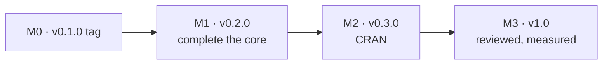

# zuhttp Roadmap

**Edition:** 2 — from v0.1.0 to 1.0, written 2026-09-25
**Companion:** [zuhttp-design.md](zuhttp-design.md), edition 2 — every work package cites the sections and decisions it implements
**History:** [history/roadmap-v1.md](history/roadmap-v1.md) — edition 1 verbatim: stages S0–S21 and U1–U6, how each landed, the 2026-09-22 review and the amends merged with it
**Status:** M0 in progress — #20 merged; `v0.1.0` not yet tagged

---

## Where 0.1.0 left things

v0.1.0 is a working HTTP/1.1 client on three platform TLS stacks: verbs,
clients and composition; strict framing; redirects; proxies and CONNECT;
gzip; a pool that is fork- and session-safe; memory, file and callback sinks;
retries, middleware and hooks; mock and cassette transports; timings, a
redacted event trace, and structured conditions. All 13 §31.16 workflows
pass. It was built in four days as one squashed PR.

What it does not yet have is the second half of the design's promises, and
the evidence for several of the first half:

| Gap | Where it stands | Owner |
|---|---|---|
| Phase timeouts | only `total` exists; no request has ever timed out in a test | W4, W7 |
| Custom CAs on Windows | refused | W8 |
| Pinning on macOS and Windows | refused | W9 |
| Revocation on OpenSSL | refused, with no way to supply a source | W10 |
| Ctrl-C bound, leaks under interrupt | unmeasured | W11 |
| Cancellable DNS | not bounded by `timeout` or Ctrl-C | W14 |
| macOS engine for CRAN | Secure Transport is deprecated and NOTEs under `--as-cran` | W13 |
| Windows TLS 1.3 | blocked on an unverified ABI | W15 |
| Performance | unmeasured against every §51.3 runtime threshold | W18 |
| Evidence in CI | pull requests from this repository ran **no CI** until W1; the Linux certificate matrix had never run until 2026-09-25 | W1 |

The last row is the one that shaped this plan. Edition 1's rule 2 said a
stage is done when its criteria pass in CI, and for most of 0.1.0's life the
CI could not show it: merges were untested, the squash erased per-stage
evidence, and the OpenSSL certificate matrix skipped itself on every run.
Edition 2 therefore starts with the machinery that makes "done" checkable.

---

## Rules

1. **A work package is done when its exit criteria pass in CI on a pull
   request**, not when the code works locally. (Edition 1 rule 2, with the
   pull request made explicit — D-70.)
2. **No work package is "mostly done".** A criterion that cannot be met yet
   stays unticked with a reason; the package stays open.
3. **Status never goes in a heading.** It goes on a `**Status:**` line. Issues
   link to headings by anchor; a heading that changes with its status breaks
   every link. This is also why the edition 1 stage headings survive, below.
4. **One pull request per work package.** Large packages may use several, each
   green; none bundles two packages.
5. **The test comes first.** A package's tests land before or with it. A test
   for behaviour not yet built is `skip()`ped naming the package, so a gap
   reads as a gap.
6. **Every test that guards a mechanism is shown to fail once.** Break the
   mechanism, watch the test fail, restore. Say so in the PR. The suite has
   passed for the wrong reason at least four times: a constant clock read as
   monotonic; a pin test accepted a refusal; a revoked host "failed" under a
   policy that failed every host; a certificate matrix skipped itself.
7. **Findings go in the log at the end, dated, append-only.** A finding that
   changes the specification also changes the design, in the same commit.

---

## Milestones

| Milestone | Version | Theme | Work packages | Gate |
|---|---|---|---|---|
| M0 | 0.1.0 | tag what shipped | — | the four M0 steps |
| M1 | 0.2.0 | the design's promises, tested | W1–W4, W6–W12 | every `zu_tls()` setting works on every backend except TLS 1.3 on macOS/Windows; phase timeouts; the export surface frozen |
| M2 | 0.3.0 | on CRAN | W13–W16, W18 | accepted on CRAN; §61.1 and §61.5 measured |
| M3 | 1.0 | others may depend on it | W17, W19 | all 14 §61 criteria; external review; `SECURITY.md` |

D-55 holds throughout: 0.x.y patch releases carry fixes only; features wait
for the next minor.

### M0 — v0.1.0

**Status:** in progress.

- [x] Merge the review (#20), with its amends: D-54, D-55 and D-56 accepted;
      #12, #14 and #52 closed; #5 and #6 reduced to their implementation
      halves; the Linux certificate matrix running.
- [ ] Tag `v0.1.0` on the merge commit and publish the GitHub release (#40).
- [ ] Close #21 and #40; retitle #22 to track M3.
- [ ] Create milestone issues for M1–M3 and one issue per work package, each
      linking its anchor below; close the edition 1 stage issues #41–#51 as
      superseded, each pointing at its work package (the map at the end).

### M1 — v0.2.0: complete the core

**Status:** not started.

**Order, and why.**

1. **W1 first.** Until pull requests run CI, rule 1 cannot be satisfied by
   anything else on this list.
2. **W2 second.** The C prefix rename touches every C file; done after W7–W11
   it would conflict with all of them.
3. **W3 and W6** while nothing depends on the package (R-11): trimming exports
   and fixing defaults is free now and a deprecation cycle later.
4. **W4 before W7.** Phase timeouts are built against tests that already make
   real requests time out, rather than against synthetic conditions.
5. **W7–W11 in any order**, in parallel if there are two people: they touch
   different files (`zu_engine.c`/`zu_net.c`; `zu_tls_schannel.c`;
   `zu_spki.c` plus two backends; `zu_tls_openssl.c`; `init.c` and the test
   harness).
6. **W12** last, because three of its four documents describe W7–W10.

**Exit criteria**

- [ ] W1–W4 and W6–W12 closed.
- [ ] `zu_info()$tls_capabilities` is `pins, ca_file, ca_extra, revocation`
      on macOS and Windows, and all five on OpenSSL when `crl_file` is set.
- [ ] Project-owned C ≤ 8,000 code lines (§51.3), measured by W1's job.
- [ ] NEWS lists every user-visible change, including D-65's removals, D-68 and D-69.

### M2 — v0.3.0: CRAN

**Status:** not started. Blocked on M1.

**Order.** W18 first — measuring against `curl` is cheap and it is the last
point at which an unfavourable number can change the plan before CRAN's
obligations begin (R-7, R-11). W13 next: it decides what ships on macOS and
resolves the `--as-cran` pragma NOTE. W14, W15 in parallel. W16 last.

**Exit criteria**

- [ ] W13–W16 and W18 closed.
- [ ] Accepted on CRAN; §61.1 green on win-builder, macOS builder and R-hub.
- [ ] §61.5 and §61.4 measured and published in the README, even if unfavourable.

### M3 — 1.0

**Status:** not started.

**Exit criteria** — "What 1.0 means", below.

---

## Work packages

Each package lists the design sections and decisions it implements, the issue
it closes, what it depends on, an estimate in focused working days with a
confidence, and exit criteria written so that each can fail.

### W1 — CI on every pull request, and to the family standard

**Status:** not started. **Milestone:** M1. **Closes:** #18. **Implements:**
D-70, §44, §48, §61.13. **Estimate:** 2 days, high.

Every job in every workflow carries `if: github.event_name != 'pull_request'
|| <fork>` while `push` fires only on `main`/`develop`, so a pull request
from this repository runs nothing. That comes first. The rest is #18.

**Exit criteria**

- [ ] A pull request from a branch of this repository runs every workflow;
      demonstrated on this package's own PR.
- [ ] R CMD check through pinned `pedrobtz/r-actions` (the commit zucrypt pins),
      including the CRAN-like containers; `coverage.yaml` pinned to a commit.
- [ ] rchk and a sanitizer build over `src/init.c` in CI.
- [ ] `tools/vendor/{manifest.tsv,checksums.sha256,verify}`, run in CI;
      editing one vendored byte fails it.
- [ ] `tls-spike.yaml` renamed for what it does (`network.yaml`); README badges
      follow.
- [ ] `dash -n` over `configure`, `configure.win` and `cleanup`.
- [ ] `library(httr2); library(zuhttp)` emits no masking message, asserted (§61.13).
- [ ] A job prints project-owned code lines on every PR and fails above 8,000
      (R-4).

### W2 — Internal C prefix `zuh_`, hidden symbols

**Status:** not started. **Milestone:** M1. **Closes:** #15. **Implements:**
D-66, D-54. **Estimate:** 1 day, high. **Depends on:** W1.

A mechanical rename of internal C identifiers from `zu_`/`ZU_` to
`zuh_`/`ZUH_` (never `zu_int_`, which is `zukomp`'s), plus
`$(C_VISIBILITY)`. The R prefix does not change.

**Exit criteria**

- [ ] No `zu_`/`ZU_` identifier remains in `src/` outside comments that cite
      R functions; `ctest/` and `fuzz/` follow.
- [ ] `test-abi.R`: the shared object exports only `R_init_zuhttp`.
- [ ] A CI step compiles `src/zuh_error.h` and `src/zuh_buffer.h` together
      with `zukomp.h` (fetched at a pinned commit) and succeeds.
- [ ] Design §1.1 and §11 updated in the same PR.

### W3 — Export surface and `zuhttp_error`

**Status:** not started. **Milestone:** M1. **Closes:** #19. **Implements:**
D-65, §53, §34.1. **Estimate:** 1.5 days, high.

**Exit criteria**

- [ ] 58 exports: the 75 of 0.1.0 minus exactly the 17 removals in design §53.
- [ ] Every condition inherits `zuhttp_error` directly above `error`, from the
      C chain (`zu_code_class_chain()`), not from R.
- [ ] Testing tools carry an "experimental" lifecycle note in their help.
- [ ] README's "the API is expected to be stable" becomes true, and says
      which functions are experimental.

### W4 — Test infrastructure: local httpbin, real timeouts, lifecycle

**Status:** not started. **Milestone:** M1. **Closes:** #50 (edition 1's U2
groups A–D). **Implements:** §50.4, §50.6. **Estimate:** 3 days, medium.
**Depends on:** W1.

**Exit criteria**

- [ ] go-httpbin runs on all three CI runners; every test and `ctest` call
      that reached `httpbin.org` goes through `ZU_HTTPBIN_URL` instead.
- [ ] A request actually times out: `/delay/5` with `timeout = 1` raises
      `zu_timeout_error` in under 2 s; `/delay/1` with `timeout = 10`
      returns 200. Both, because the first alone passes for a client that
      always times out.
- [ ] A stall mid-body (a server that sends headers and stops) raises within
      `timeout`. This is the fixture W7's `read` timer is built against.
- [ ] `test-lifecycle.R`: the pool finalizer runs under `gc()` and closes its
      sockets; a finalizer in a forked child does not close the parent's.
      Each shown to fail with its mechanism disabled.
- [ ] badssl rows A2–A5: TLS 1.0/1.1 and RC4/DH1024 refused; SHA-1
      intermediate and no-CN certificates rejected; `incomplete-chain`
      recorded per backend.
- [ ] `tests/spelling.R` with `inst/WORDLIST`.

### W6 — Correct two shipped defaults

**Status:** not started. **Milestone:** M1. **Implements:** D-68, D-69,
§19.4, §21.4. **Estimate:** 0.5 day, high.

**Exit criteria**

- [ ] `redirects` defaults to 10; a 3-hop redirect chain succeeds with the
      default client (it fails today).
- [ ] `max_decompression_ratio` defaults to 1000 and is passed at
      `zu_body.c:35`; a 1 KB → 100 MB bomb fails after less than 1 MB of
      output, with the absolute cap raised out of the way to prove it is the
      ratio that fired.
- [ ] Both in NEWS as behaviour changes.

(W5 is retired: it was "tag v0.1.0", now M0.)

### W7 — Phase timeouts

**Status:** not started. **Milestone:** M1. **Closes:** #13, #41.
**Implements:** D-57, D-58, §24. **Estimate:** 3 days, medium.
**Depends on:** W4.

**Exit criteria**

- [ ] `zu_timeout(total, connect, read, write)`; `timeout =` accepts it or a
      number everywhere; `zu_req_timeout()` sets any subset; merging follows
      §31.9.
- [ ] Each phase fires with its own `phase` in the condition, against W4's
      fixtures: `connect` against a non-routable address, `read` against a
      mid-body stall, `total` across a redirect chain and across retries.
- [ ] `read` does not fire on a slow transfer that keeps moving (a 5 s
      trickle with `read = 1`).
- [ ] `zu_info()` and `print(client)` show the timeout model.
- [ ] Offline: §24.2 composition arithmetic in `ctest`.

### W8 — Windows custom CAs, and the certificate matrix on Windows

**Status:** not started. **Milestone:** M1. **Closes:** #5, #43 (with W9,
W15). **Implements:** D-61, §14.3, §50.5. **Estimate:** 4 days, **low** —
CryptoAPI chain engines, no local Windows machine.

The matrix fixture needs a POSIX shell only to capture the `s_server` PID.
Port it with `processx` in Suggests, which gives a PID on every platform;
Windows runners ship an `openssl` CLI with Git.

**Exit criteria**

- [ ] First, an S1-style probe on CI: Rtools' `wincrypt.h` declares
      `CERT_CHAIN_ENGINE_CONFIG.hExclusiveRoot` and
      `CERT_CHAIN_EXCLUSIVE_ENABLE_CA_FLAG` (if not, D-61 is revised before
      any backend code is written).
- [ ] The §50.5 matrix runs on the Windows CI leg — every row, not a subset.
- [ ] `ca_file` and `ca_extra` rows pass on Windows with the same
      certificates as elsewhere: `ca_extra` + public host → 200; `ca_file` +
      public host → `zu_tls_certificate_error`.
- [ ] An expired certificate under `ca_extra` is rejected — D-61's second
      pass must not rescue a chain that failed for a reason other than its
      root.
- [ ] A malformed PEM raises `zu_tls_error` naming the file.
- [ ] Before writing the backend code, an interactive debugging session on a
      Windows runner is available (tmate or equivalent): nine blind CI rounds
      in S8 are not repeated.

### W9 — Pinning on macOS and Windows

**Status:** not started. **Milestone:** M1. **Closes:** #4, #12 (its
implementation half), #42, #44 (pin rows). **Implements:** D-60, §14.4.
**Estimate:** 3 days, medium.

**Exit criteria**

- [ ] `src/zu_spki.c` (or `zuh_spki.c` after W2): the bounded DER walker, no
      allocation, ≤ 150 lines.
- [ ] `ctest`: the walker and OpenSSL's `i2d_X509_PUBKEY` agree on a corpus of
      at least 20 real certificates (RSA, EC P-256, P-384, Ed25519); every
      truncation of each is rejected without a read past the buffer, under
      ASan.
- [ ] Fuzz target 10, with that corpus as seeds.
- [ ] The three §50.5 pin rows pass on all three backends.
- [ ] `zu_info()$tls_capabilities` includes `pins` everywhere.

### W10 — Revocation: a source for OpenSSL, measurements for the rest

**Status:** not started. **Milestone:** M1. **Closes:** #6. **Implements:**
D-62, §14.5. **Estimate:** 2 days, medium.

**Exit criteria**

- [ ] `zu_tls(crl_file = )`; OpenSSL honours `revocation = TRUE` exactly when
      it is set, and refuses otherwise.
- [ ] The fixture generates a CRL and a revoked leaf: revoked → rejected with
      `zu_tls_certificate_error`, valid → accepted, on every backend that
      honours revocation. This closes edition 1's S9 criterion 4 without a
      public responder.
- [ ] Schannel's `CHAIN_EXCLUDE_ROOT` behaviour measured against that fixture
      and written into design §14.5.

### W11 — Cancellation, measured

**Status:** not started. **Milestone:** M1. **Closes:** #7, #45.
**Implements:** §25, §50.6, §61.4. **Estimate:** 2 days, medium.

**Exit criteria**

- [ ] A test-only hook in `init.c` raises R's interrupt flag on the k-th poll
      tick; with it, an interrupt in connect, TLS, TTFB and body phases
      returns within 200 ms, on every CI leg.
- [ ] The same four phases leak no descriptor and no TLS context, under ASan
      and under valgrind.
- [ ] Manual measurement in Rterm, Rgui and RStudio on Windows and macOS,
      recorded in design §25.4; `R_ProcessEvents()` added if a GUI needs it.
- [ ] README's "Ctrl-C timing unverified" row removed or replaced by a number.

### W12 — Documentation

**Status:** not started. **Milestone:** M1 (documents), M2 (usability test).
**Closes:** #8, #9, #10, #11, #48. **Implements:** §55, §61.11.
**Estimate:** 3 days, high. **Depends on:** W7, W8, W9, W10 for the TLS and
timeout documents.

**Exit criteria**

- [ ] A shipped vignette on TLS, trust and refusals (#8), built from the
      capability table in design §14.7.
- [ ] Articles: getting started (#10), testing code that makes requests (#9),
      retries/timeouts/cancellation (#11).
- [ ] Every limitation in design edition 2 marked Partial appears in
      user-facing help (edition 1 S20 criterion 2).
- [ ] M2: three R users new to the package each write a GET and a JSON POST
      in five minutes from the reference index (§61.11).

### W13 — The macOS engine for CRAN

**Status:** not started. **Milestone:** M2. **Closes:** #16, #51, #44.
**Implements:** D-63, §13.2. **Estimate:** spike 4 days, low; implementation
depends on the answer.

A spike in the S0 shape: measure, do not commit.

**Exit criteria**

- [ ] Every "unmeasured" cell of design §13.2's table has a number, for
      Network.framework and for a trimmed, hidden-visibility Mbed TLS (reusing
      zucrypt's TF-PSA-Crypto manifest row).
- [ ] D-63 decided in the register, with the measurements.
- [ ] The chosen engine passes the full §50.5 matrix, CONNECT through a proxy,
      W7's timeouts and W11's cancellation tests.
- [ ] `--as-cran` has no pragma NOTE.
- [ ] If the answer bundles cryptography, design §2 and §56 constraint 2 are
      amended in the same PR.

### W14 — Cancellable DNS

**Status:** not started. **Milestone:** M2. **Closes:** the last of #14.
**Implements:** D-59, §8.4, §29.1. **Estimate:** 3 days, medium.

**Exit criteria**

- [ ] A resolver that never answers (a local UDP socket that swallows
      queries, pointed to by `RES_OPTIONS`/`resolv.conf` on Linux) no longer
      holds R: `connect` fires on time and Ctrl-C returns within 200 ms.
- [ ] The helper thread never calls the R API — checked by a build that
      poisons R symbols in the helper's translation unit — and runs clean
      under TSan.
- [ ] The ninth abandoned lookup raises `zu_dns_error` instead of spawning.
- [ ] D-30 marked superseded; every "DNS ignores timeout" sentence removed
      from the help and README.

### W15 — Windows TLS 1.3

**Status:** not started. **Milestone:** M2. **Closes:** #17.
**Implements:** D-64, §13.4, §47.4. **Estimate:** 2 days, low.

**Exit criteria**

- [ ] A Windows CI job compiles one layout probe with MSVC and with mingw plus
      the local declaration, and fails on any `sizeof`/`offsetof` difference.
- [ ] With it green, `SCH_CREDENTIALS` on Windows 10 1809+, `SCHANNEL_CRED`
      below; a TLS 1.3 server negotiates 1.3; `tls13` in the capability mask.
- [ ] Or, if the ABI cannot be proven: scope cut 4 recorded as taken, README
      says Windows is TLS 1.2.

### W16 — CRAN packaging

**Status:** not started. **Milestone:** M2. **Closes:** #47.
**Implements:** §47, §49. **Estimate:** 2 days plus review turnaround.
**Depends on:** W13.

**Exit criteria**

- [ ] `R CMD check --as-cran`: 0 errors, 0 warnings, only the new-submission
      NOTE, on win-builder, the macOS builder and R-hub.
- [ ] The missing-OpenSSL `configure` path runs in CI and prints §47.3's
      message.
- [ ] Cold compile time measured (§51.3).
- [ ] Submitted; accepted.

### W17 — Fuzzing soak

**Status:** not started. **Milestone:** M3. **Closes:** #46.
**Implements:** §43, §61.8. **Estimate:** 1 day of setup, 11 days of machine time.

**Exit criteria**

- [ ] 24 h of libFuzzer per target, all ten, with ASan and UBSan: 0 crashes,
      0 reports. Each new crash becomes a committed seed.

### W18 — Measure the premise

**Status:** not started. **Milestone:** M2. **Implements:** §51, §1.2, §61.5,
§62 Q10, Q19. **Estimate:** 2 days, medium.

**Exit criteria**

- [ ] The §51.2 benchmarks against `curl` on three platforms, scripted under
      `tools/bench/`, results in design §51.3.
- [ ] Each of §1.2's three claims substantiated with a number or deleted.
- [ ] If keep-alive p50 is worse than 2× `curl`, R-7's trigger is taken
      seriously in writing before W16 starts.

### W19 — Security review and policy

**Status:** not started. **Milestone:** M3. **Closes:** #49.
**Implements:** §45, §46, §61.9. **Estimate:** 2 days plus the reviewer's time.

**Exit criteria**

- [ ] External review of the TLS glue, framing, the DER walker and the DNS
      helper; every finding fixed or accepted in writing.
- [ ] `SECURITY.md` with the §46.1 SLA; a contact that is not only the
      maintainer's inbox.
- [ ] A second maintainer with CRAN rights, or the bus-factor risk stated at
      the top of the README.
- [ ] The §34.4 message catalogue reviewed: no message is only a backend code.

---

## What 1.0 means

1.0 is the version other packages may depend on without reservation. It
requires all of:

- [ ] All 14 §61 success criteria measured and passing, each gated in CI where
      §61 says it is automatable.
- [ ] M1 and M2 complete, or a platform scope cut recorded as taken and stated
      in the README.
- [ ] External security review complete (W19).
- [ ] `SECURITY.md` and a patch SLA published.
- [ ] A second maintainer, or the risk stated prominently.
- [ ] No Decision Register row reads Open or Proposed.
- [ ] §1.2's claims substantiated or withdrawn.

If the measurements do not support "smaller, auditable and competitive", the
right outcome is to say so and let users choose `curl`.

---

## Scope cuts, in the order they should be taken

Strict framing, redaction and the fork guard are not cuttable (§57.1).

| Order | Cut | Cost | Saves |
|---|---|---|---|
| 1 | W15: ship Windows at TLS 1.2 | protocol parity on Windows | 2 days, and an ABI risk |
| 2 | W14: keep DNS uninterruptible (D-30) | the last hole in cancellation | 3 days, and the only thread |
| 3 | W10's `crl_file` | revocation on OpenSSL | 1 day |
| 4 | Cassettes, as unexported and experimental | downstream testing convenience | maintenance |
| 5 | W13 finds nothing acceptable: CRAN without macOS binaries' TLS 1.3, Secure Transport kept and its NOTE argued | TLS 1.3 on macOS; a harder CRAN review | 1–2 weeks |

---

## Edition 1 stage map

Edition 1's stages survive as headings so that every issue linking to them
still lands somewhere useful. Each points to where its remaining work lives.
Full text: [history/roadmap-v1.md](history/roadmap-v1.md).

| Stage | State at 0.1.0 | Remaining work |
|---|---|---|
| S0–S5, S10–S14, S16, S17 | complete | — |
| S6, S7, S8, S9, S15, S18, S19, S20, S21 | below | below |
| U1, U4, U5, U6 | complete | — |

### S6 · Sockets, poll, deadlines

Partial: no inactivity or phase timers. → **W4, W7.**

### S7 · OpenSSL engine and trust

Partial: revocation refused. Pin rows and the Linux matrix landed with the
review's amends, 2026-09-25. → **W10.**

### S8 · Schannel

Partial: custom CAs, pinning and TLS 1.3 refused; `min_version = 13` now
refused rather than silently downgraded. → **W8, W9, W15.**

### S9 · macOS engine and trust

Partial: pinning refused; revocation criterion needs a local revoked
certificate; the engine for CRAN undecided. → **W9, W10, W13.**

### S15 · Cancellation and unwind

Partial: 200 ms bound and leaks under interrupt unmeasured; DNS outside the
bound. → **W11, W14.**

### S18 · Fuzzing, sanitizers, CI

Partial: no 24 h soak; CI below the family standard. → **W1, W17.**

### S19 · CRAN packaging

Deferred. → **W13, W16.**

### S20 · Documentation

Partial: README and two help topics. → **W12.**

### S21 · Security review → 1.0

Not started. → **W19.**

### U2 — Test-framework hardening

A1 done; groups A–D remain. → **W4.**

### U3 — Spike: Mbed TLS as the macOS portable engine

Folded into the wider engine spike. → **W13.**

### Release scope: v0.1.0 — decided 2026-09-10

A GitHub release, not a CRAN submission, because the macOS engine for CRAN
was undecided. It still is; that is W13. → **M0.**

### Stage by stage

Edition 1's per-stage table of what 0.1.0 contains is in the history file;
the table above supersedes it.

---

## Findings log

Append-only. Newest last. Each entry: date, what was found, how, and where it
changed the plan or the design.

- **2026-09-22 — the review (#20).** Stage markers disagreed with their own
  exit criteria in S2, S8 and S9; the design said 0.1.0 shipped the full
  §24 timeout model and it shipped `total` only; `?zuhttp_tls` said Schannel
  pins. All corrected in edition 1; lessons in its "Review 2026-09-22".
- **2026-09-25 — Schannel ignored `min_version`.** `zu_tls(min_version =
  13)` connected at TLS 1.2 on Windows. The only test skipped every backend
  but Secure Transport. Fixed by D-56's table-driven refusal.
- **2026-09-25 — the pin test passed on Windows without pinning.** A refusal
  used the mismatch class, and the test accepted any `zu_tls_error`. Fixed by
  D-56's separate class; rule 6.
- **2026-09-25 — the §50.5 matrix had never run on Linux.** `x509
  -not_before` is OpenSSL 3.4+; Ubuntu has 3.0; the fixture skipped all rows.
  Fixed with an `openssl ca` fallback. Rule 6, again.
- **2026-09-25 — a pinned request's chain failure was reported as a pin
  mismatch** on OpenSSL: the translation read a never-set flag. Found by the
  pin-over-untrusted-chain row on the matrix's first Linux run; fixed before
  #20 merged. Rule 6 — and the reason every §50.5 row asserts a *class*, not
  just a failure.
- **2026-09-25 — pull requests from this repository run no CI.** Every job is
  skipped on same-repository `pull_request` events and `push` covers only
  `main`/`develop`. The review's own PR showed every check "skipped". → W1.
- **2026-09-25 — two shipped defaults contradict the design.** `redirects =
  1` (the slice's value, never revisited) against §19.4's 10; the
  decompression ratio limit implemented and passed 0. → W6 (D-68, D-69).
- **2026-09-25 — project-owned C is at 80% of its budget** (6,379 of 8,000
  code lines) with ~900 lines of planned work. R-4 is live. → W1's size gate.
