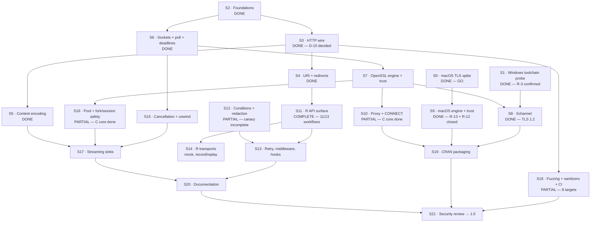

# zuhttp Roadmap to 1.0

**Companion to:** [zuhttp-design.md](zuhttp-design.md)
**Status:** Draft
**Last updated:** 2026-09-08 · **S0–S9, S11, S12, S15, S16 complete or explicitly partial**
**Total estimate:** 41–48 person-weeks (§64 of the design doc, plus spikes)

---

## How this roadmap is organised

Every stage below is **independently completable and independently verifiable**. The test for whether a stage belongs on this list is:

> Can it be finished, tested, and reviewed without any other unfinished stage existing?

That constraint is what makes the plan parallelisable and what makes a stalled stage survivable. It is achievable here because of one architectural property: **the `zu_stream` interface (§9) sits between the HTTP engine and the network.** The entire HTTP engine — parsing, framing, redirects, decompression, pooling logic — can be built and fully tested against a mock stream feeding canned bytes, with no sockets and no TLS. That decouples Track B from Track C completely, and it is the single most valuable structural decision for delivery speed.

Three rules govern the whole plan:

1. **Spikes before slices.** Stages S0 and S1 answer go/no-go questions and cost days. Everything else is speculative until they land.
2. **A stage is done when its exit criteria pass in CI**, not when the code is written.
3. **No stage may be "mostly done".** A half-finished stage blocks its dependents exactly as much as an unstarted one, but hides it.

---

## Dependency graph



Four tracks run in parallel after S2:

| Track | Stages | Depends on network? | Depends on R? |
|---|---|---|---|
| **A · Spikes** | S0, S1 | yes | no |
| **B · Engine** | S2–S5 | **no** — mock stream only | no |
| **C · Transport** | S6–S10 | yes | no |
| **D · R layer** | S11–S14 | **no** — R transport stub | yes |
| **E · Hardening** | S15–S21 | mixed | mixed |

Tracks B and D are the two that can absorb a second contributor with no coordination cost.

---

## The §63.2 vertical slice — ✅ **COMPLETE**

Before Track D proper, the pieces were wired together end to end, because
everything up to this point had been proven correct **separately** and never
composed. `src/zu_engine.c` plus `zu_get()` in R:

    URL -> TCP -> TLS (verified) -> request -> response -> framing
        -> chunked -> gzip -> one redirect -> memory body -> R raw vector

It worked on the first integration, which is the useful result: the interfaces
the earlier stages were designed against fitted together without rework.

    status=200  bytes=559  tls=TLSv1.3/TLS_AES_256_GCM_SHA384
    class: zu_tls_certificate_error < zu_tls_error < zu_error < error < condition

**What it also forced:** `./configure` (S19 work, pulled forward because
nothing could link OpenSSL from the package build), and `zu_headers_at()` /
`zu_headers_total()` so the R layer can present every field.

**Deliberately not in it:** the pool (one connection per request), proxies,
retries, streaming sinks, and Ctrl-C. Each has its own stage. Wiring them in
before the simple path worked would have made the first integration failure
much harder to read. **Ctrl-C in particular is listed as a §63.2 capability
and is NOT delivered** — it needs `R_UnwindProtect` (S15), and a bare
`R_CheckUserInterrupt()` in the tick callback would longjmp past live C
allocations.

**Also not yet true to the design:** the slice uses OpenSSL on *every*
platform, including Windows and macOS. D-5 and D-4 call for Schannel and the
system trust store; those are S8 and S9. DESCRIPTION says so explicitly.

**RESOLVED by S8 (2026-09-08): Windows now uses Schannel and HTTPS works.**
What follows is the finding that made D-5 mandatory rather than preferred.

**The OpenSSL shortcut did not work on Windows at all**, which CI established
the moment the slice ran there:

```
Error in zu_get("https://example.com") :
  certificate verification failed for 'example.com':
  unable to get local issuer certificate
```

The package *builds and links* fine under Rtools — the failure is at runtime.
OpenSSL on Windows looks for a CA bundle at a path compiled into the library
which does not exist, and it does not consult the Windows certificate store.
There are no trust anchors, so every certificate fails.

This is D-5's rationale, confirmed by measurement rather than argument:
**HTTPS on Windows requires Schannel (S8), not merely prefers it.** Until S8
lands, Windows can build the package but cannot make an HTTPS request, and
DESCRIPTION and `?zu_get` both say so.

---

## Track A — Feasibility spikes

These gate the architecture. They are days of work and must happen **first**. Building engine code before S0 answers is not wasted (Track B is TLS-agnostic), but building any TLS code before it is.

### S0 · macOS TLS spike — ✅ **COMPLETE 2026-09-07 · verdict: GO**

**Retired:** Appendix B R-1, the project's highest risk.
**Answered:** Decision D-4 — **Accepted**.
**Actual effort:** under 1 day (estimated 1 week).
**Artifacts:** [`spike/macos-tls/`](../spike/macos-tls/) — [FINDINGS.md](../spike/macos-tls/FINDINGS.md), 16/16 assertions via `make test`.

Build ~200 lines that:

- open a TLS 1.3 connection to a real host,
- evaluate the chain with `SecTrustEvaluateWithError` against the system Keychain,
- drive the handshake and one request/response from a **synchronous non-blocking poll loop**,
- use **no background thread** and touch no R API.

**Exit criteria**

- [x] Connects to at least 5 real hosts — TLS 1.3, `trust=SecTrust:yes`.
- [x] Custom root honoured — proven via `SecTrustSetAnchorCertificates` without touching the developer's Keychain.
- [x] Expired / wrong-hostname / unknown-issuer rejected with distinguishable, human-readable errors.
- [x] Handshake completes non-blocking with the caller owning `poll()` — 3 checkpoints, longest block 12.9 ms at a 100 ms tick.
- [ ] **Peak thread count is 1** — ❌ **failed: 1 → 3.** Security.framework opens an XPC connection to `trustd`. This turned out to matter far more than expected (F-5).

**Findings that changed the plan**

| | Finding | Effect |
|---|---|---|
| F-1 | Secure Transport has no `kTLSProtocol13` | the fallback is **TLS 1.2-only**, not merely deprecated |
| F-3 | `SSL_VERIFY_NONE` silently accepted every bad cert | negative cert tests mandatory from day one (§50.5; S7, S8, S9) |
| F-4 | Revocation **not** checked by default; enabling costs 7–15× and makes an uninterruptible network call | §14.5 was wrong; corrected. New D-31 |
| F-5 | **`SecTrustEvaluateWithError` does not survive `fork()`** — child SIGSEGVs | **new risk R-12**; S16 scope grows; new D-32 |
| F-6 | `SecTrustSetAnchorCertificatesOnly` gives both `ca_file` and `ca_extra` semantics | §14.2 confirmed implementable; unblocks CI trust testing |

**New work created:** S16 must guard the trust evaluator, not just the pool. S9 must resolve which portable engine is CRAN-viable on macOS (R-13) — the spike used Homebrew OpenSSL, which is not a shippable answer.

### S1 · Windows toolchain probe — ✅ **COMPLETE 2026-09-07 · R-3 CONFIRMED**

**Outcome:** Appendix B R-3 confirmed, not retired.
**Actual effort:** ran on CI; no Windows machine needed.
**Artifacts:** [`spike/windows-schannel/`](../spike/windows-schannel/) — [FINDINGS.md](../spike/windows-schannel/FINDINGS.md), job `windows-s1` in `tls-spike.yaml`.

**Exit criteria**

- [x] Exact set of missing declarations documented: `SCH_CREDENTIALS` and `TLS_PARAMETERS` typedefs absent; the TLS 1.3 *macros* are present.
- [x] TLS 1.2 fallback path confirmed to compile; SSPI and CryptoAPI confirmed to link and run.
- [x] Decision recorded — see below.

**Verdict.** Rtools' mingw-w64 11.0 `schannel.h` is incomplete for TLS 1.3. This is **not** a version gate: `-D_WIN32_WINNT=0x0A00` does not make the typedefs appear. Because the constants already exist, only two structures need declaring locally (~30 lines).

**New work created (S8):** declare `SCH_CREDENTIALS` and `TLS_PARAMETERS` behind a feature guard, **and verify their ABI on a real Windows 10+ target** — a wrong layout passed to `AcquireCredentialsHandle` is a memory-safety bug, not a compile error. If the ABI cannot be verified confidently, ship Windows TLS 1.2-only for v1 (new open question §62.1 Q2a).

---

## Track B — Engine (no network, no R)

The whole track is testable through the mock stream. It needs no TLS backend, no sockets, and no R session. This is where the parser and URI decisions (D-10, D-11) got made by measurement rather than argument — both are now settled.

### S2 · Foundations

**Effort:** 1.5 weeks. **Depends on:** nothing.

Checked growable buffer; `zu_alloc`/`zu_realloc`/`zu_free` with overflow checks (§41); the `zu_error` type and code registry (§34.2); monotonic clock shims (§24.4); the `zu_stream` vtable (§9); and the **mock stream** (§50.1) that replays a byte script with configurable chunk boundaries and injectable errors.

**Exit criteria**

- [ ] Mock stream can deliver any byte sequence split at any boundary, including one byte at a time.
- [ ] Allocator rejects every overflow case in its test matrix.
- [ ] Builds standalone with no R headers — this is what makes S18 possible.

### S3 · HTTP wire

**Effort:** 3 weeks. **Depends on:** S2.

Request builder with header-injection rejection (§17.1); default headers (§17.2); response parser wrapper; **strict framing** (§18.1); chunked decoding with trailers (§18.2); duplicate-header container (§18.3); header limits enforced pre-parse (§18.4).

Implement against a thin parser interface and build **both** picohttpparser and llhttp behind it. This stage decides D-10.

**Exit criteria**

- [x] Every row of the §18.1 framing table is a passing test.
- [x] Obsolete line folding, malformed status lines, and invalid header names rejected.
- [x] Chunked decoding with trailers, truncation, malformed chunk sizes, and a bounded decoded total.
- [x] **D-10 decided and recorded: picohttpparser** (803 LOC, MIT, commit `f4d94b4`).
- [ ] The full §50.3 malformed corpus — a broader corpus lands with S18 fuzzing.

**Note on how D-10 was settled.** The strictness layer was built *before* the parser was chosen, which changed the terms of the decision: Appendix A.3's case for llhttp rested on ~800–1,200 lines of framing code being an unpaid cost. With `zu_framing.c` written and tested first, that cost was already incurred, and the comparison reduced to 803 vendored LOC versus ~8,000 for a parser whose remaining job is splitting a status line and a header block.

**Standing consequence:** picohttpparser rejects no smuggling attempt on our behalf. `zu_framing.c` is the only thing that does, which makes it the primary S18 fuzz target rather than a secondary one.

### S4 · URI and redirects

**Effort:** 2.5 weeks. **Depends on:** S3.

RFC 3986 parsing and relative resolution; IPv6 literals; query encoding (§8.2); redirect method/body rewriting (§19.1); cross-origin header stripping (§19.2); downgrade policy (§19.3); chain-wide limits (§19.4); sink isolation (§19.5).

**D-11 resolved: a parse/resolve/recompose SUBSET of uriparser 0.9.8** (8 `.c`
files, ~3.9k code lines), behind the flat `zu_uri` struct, with the client
policy layer in `zu_uri.c`. The subset was derived by linking, not by reading
includes; `tools/update-uriparser` re-derives it on every refresh and fails if
upstream adds a dependency edge. Six of uriparser's eight historical CVEs are
in files the subset excludes — see `src/vendor/uriparser/VENDOR`.

**Exit criteria**

- [x] Passes an RFC 3986 §5 reference resolution test vector set (§5.4.1 normal
      examples and the §5.4.2 abnormal `..`-above-root cases).
- [x] Every row of the §19.1 rewrite table is a passing test.
- [x] Credentials verifiably stripped on scheme, host, **and port** change.
- [x] Redirect bodies never reach the sink.
- [x] Non-ASCII hostnames rejected with a clear error (D-14).
- [x] **D-11 decided**, with the real LOC recorded against the §51.3 budget
      (3.9k, not the 15k the design had carried for two drafts).
- [x] Parser allocates through `zu_alloc`: 0 of 400 OOM injection points leak.
- [x] Port 65536 rejected rather than truncated; empty DNS labels rejected;
      embedded NUL rejected; input parsed as a byte range, not a C string.

### S5 · Content encoding

**Effort:** 1 week. **Depends on:** S3.

System zlib linkage; gzip/zlib auto-detection; raw-deflate fallback (§21.3); incremental enforcement of `max_decompressed_bytes` and `max_decompression_ratio` (§21.4).

**Exit criteria**

- [x] Both `deflate` wrappings decode (zlib-wrapped and raw), decided from the header signature.
- [x] A real bomb — 400 KB of zeros under 2 KB compressed — fails on the output cap with bounded allocation, and again on the ratio cap.
- [x] A legitimate high-ratio body under both caps still succeeds.
- [x] `Transfer-Encoding: gzip` rejected in `zu_framing` per §18.1.

---

## Track C — Transport

### S6 · Sockets, poll, deadlines

**Effort:** 2 weeks. **Depends on:** S2. **Blocks:** S7, S15.

Non-blocking sockets on POSIX and Winsock; `poll`/`WSAPoll` loop; the deadline composition rule (§24.2); DNS via `getaddrinfo` with the documented non-interruptibility gap (§8.4).

**Exit criteria**

- [x] `effective_deadline = min(now + phase, request_deadline)` holds under test.
- [x] A stalled read ends at the deadline rather than blocking, verified by
      elapsed time. **This was ticked prematurely.** It held on macOS and
      Windows; on Linux `zu_now_ms()` returned 0 forever (see below), so no
      deadline expired and this test hung instead of passing. Re-verified on
      all three platforms as of 28fe55d.
- [x] The tick callback fires at the configured cadence and can cancel a stalled read — this is the seam where `R_CheckUserInterrupt()` lands at S15, and it is why the core needs no R headers to be interruptible.
- [x] Refused connection, unresolvable host, and orderly close each produce the right code and phase.
- [x] Monotonic clocks only; a wall-clock change cannot move a deadline.
- [x] **The clock is not merely monotonic but actually advances.** Added after
      the fact: `src/zu_time.c` lacked the `_POSIX_C_SOURCE` preamble, so
      `-std=c99` hid `CLOCK_MONOTONIC` on glibc and `zu_now_ms()` fell through
      to `return 0`. Every timeout in the library was inoperative on Linux.
      suite_time asserted the clock was *monotonic*, which a constant
      satisfies, so it passed for six commits while the Linux C jobs hung.
      The fallback is now a build error, the suite asserts the clock advances
      and that a short deadline expires, and `tools/check-feature-macros`
      (run in CI) prevents a third instance of the class.
- [ ] Inactivity timers reset on progress — arrives with the engine loop, which has no caller yet.

### S7 · OpenSSL engine and trust

**Effort:** 2 weeks. **Depends on:** S6.

The reference implementation of the §13.1 engine/trust split. Hostname verification via `X509_VERIFY_PARAM_set1_host` — never hand-rolled. `ca_file`/`ca_data`/`ca_extra` semantics (§14.2). Pinning (§14.4).

**Exit criteria**

- [ ] The full §50.5 certificate matrix passes with distinguishable condition classes.
- [ ] `ca_extra` adds to system trust; `ca_file` replaces it. Both proven by test.
- [ ] Pin match and mismatch both behave, and pinning does not bypass chain verification.

### S8 · Schannel — ✅ **COMPLETE 2026-09-08 (TLS 1.2)**

**Estimated:** 4–6 weeks, "the largest single line item in the plan and the
lowest-confidence estimate". **Actual:** ~570 lines, nine CI rounds.
**Retires:** Appendix B R-2 — the size fear did not materialise.

`src/zu_tls_schannel.c`. SSPI for the protocol, `CertGetCertificateChain` +
`CertVerifyCertificateChainPolicy` for trust, with
`SCH_CRED_MANUAL_CRED_VALIDATION` so §13.1's split holds. Verified on CI:

```text
status 200 tls TLSv1.2 bytes 559
expired    -> zu_tls_certificate_error
wrong host -> zu_tls_hostname_error
```

**Exit criteria**

- [x] Same §50.5 matrix as S7, same condition classes — 21 C-level checks plus
      the R-level slice.
- [x] **LOC measured as written: ~570**, against a 3,500 escalation threshold.
      The estimate was out by roughly 6x, and the reason is worth recording:
      the estimate assumed renegotiation and `ApplyControlToken` shutdown,
      neither of which a client doing HTTP/1.1 needs.
- [ ] Additive custom CA through an in-memory store (§14.3). **Not
      implemented.** Configuring `ca_file`/`ca_data`/`ca_extra` on Windows
      raises an error rather than silently ignoring the setting and using
      system trust anyway.
- [ ] TLS 1.3. Needs `SCH_CREDENTIALS`, still absent from Rtools45/GCC 14.3
      (R-3, re-confirmed 2026-09-08). A toolchain bump will not fix it.

**What it cost, and why.** Nine CI rounds with no Windows machine in the loop.
Four found real defects: a constant that lives in `wininet.h`, a
`SECBUFFER_EXTRA` underflow that was the actual segfault, an uninitialised
`inb` read found by reading rather than testing, and an `R_FindNamespace`
PROTECT bug that predates S8 and affected all three platforms.

The other five were spent on a crash that did not exist: a multi-line
`Rscript -e` argument fails on Windows before executing anything, and
`continue-on-error` on the diagnostic steps turned their green ticks into
noise I mistook for evidence. **Every R check in CI now runs from a file, and
diagnostic steps that are meant to inform a decision must not carry
`continue-on-error`.**

### S9 · macOS engine and trust

**Effort:** 3–5 weeks. **Depends on:** S0 ✅.

Implements the S0-validated design: portable engine + `SecTrustEvaluateWithError`. `spike/macos-tls/tls_spike.c` is the working reference for the handshake pump, the `cert_verify_callback` → SecTrust bridge, and anchor handling.

**Exit criteria** — S7's, plus the three the spike created:

- [ ] Same §50.5 matrix as S7, same condition classes.
- [ ] **A CRAN-viable engine is identified and building** (R-13). Homebrew OpenSSL is not an answer; this is the stage's real risk, not the TLS code.
- [ ] `SSL_VERIFY_PEER` set, with a test proving an invalid certificate aborts the handshake (F-3).
- [ ] `zu_tls(revocation = TRUE)` works and is off by default (F-4).

### S10 · Proxy and CONNECT

**Effort:** 2 weeks. **Depends on:** S7.

Environment parsing including the lowercase-only `http_proxy` rule (§20.1); `NO_PROXY` matching on label boundaries (§20.2); absolute-form requests; CONNECT tunnelling parsed with full §18 strictness; Basic proxy auth with the §20.4 leakage rules.

`zu_proxy.{h,c}`. The environment is read through a seam rather than by
calling `getenv()` directly, so the §20.1 and §20.2 rules are tested against a
table — mutating the real environment is not thread-safe, leaks between tests,
and cannot express "unset" reliably on Windows.

**Exit criteria**

- [x] `NO_PROXY` matches `api.example.com` for `example.com` but not
      `notexample.com`. Also: `*`, leading dots, ports (`example.com:8080`),
      bracketed IPv6 with a port, case-insensitivity, and IP literals matching
      exactly rather than by suffix — without which `1.2.3.4` would bypass the
      proxy for the unrelated host `10.1.2.3.4`.
- [x] Proxy URL credentials are moved out of the URL at parse time and
      percent-decoded, so `p%40ss` authenticates as `p@ss` rather than being
      sent literally.
- [x] A non-2xx CONNECT surfaces the proxy's status; 407 is a distinct
      `zu_proxy_auth_error`. CONNECT responses are parsed with full §18
      strictness — a proxy is not exempt, and a lenient parse there is a
      tunnel built on a lie.
- [x] `Proxy-Authorization` is generated only inside
      `zu_proxy_connect_request()`, i.e. only on the connection to the proxy.
      **The "provably never reaches an origin, including across a redirect"
      half needs the request engine (S11+) to be provable end-to-end**; at
      this layer there is no code path that could add it to an origin request.
- [x] `http_proxy` is honoured but `HTTP_PROXY` is ignored (httpoxy, §20.1).

**Blocked:** absolute-form and CONNECT are built and unit-tested, but nothing
drives them over a real socket yet — that is the request engine.

---

## Track D — R layer

Buildable against an R-level transport stub before any C transport exists.

### S11 · R API surface — ✅ **COMPLETE 2026-09-08**

**Effort:** 3 weeks. **Depends on:** S4.

`zu_client()`, `zu_request()`, method helpers, `zu_perform()`; the single-signature rule with `client =` always named (§31.3); configuration merging (§31.9) including `NA` removal and `NULL` reset; request and response printing; accessors (§31.7) including charset handling and the `jsonlite`-in-Suggests decision.

Three decisions the design had left open were resolved here and written back to
it: **D-33** `check = TRUE` by default, **D-34** `base_url` is joined rather
than RFC 3986-resolved, and **D-35** the three-state policy merge that the
`NULL`-resets rule turns out to require (absent, `NULL`, value — `missing()`
plus a reset sentinel, because an R list cannot hold a `NULL` as a value).

The C side grew three things the R surface needed: `ZU_ERR_HTTP_STATUS` and its
4xx/5xx children, so `zu_resp_check()` raises §34.1 classes from the one
class-chain definition in C rather than a second table in R; a `no_decode`
option behind `decode = FALSE` (§21.2), which also sends
`Accept-Encoding: identity` — a caller asking for wire bytes wants the server
to stop encoding, not just for us to stop decoding; and `decode` as an
eleventh argument to `C_zu_perform`.

**Exit criteria**

- [x] All 13 workflows in §31.16 run against the stub transport. **11 of 13.**
      Workflow 5 (retry) and workflow 6 (streaming download) belong to S13 and
      S17 and have no implementation to exercise; both are `skip()`ped by name
      in `test-workflows.R` rather than omitted, so the gap is visible in the
      test output instead of looking like coverage. The other eleven pass,
      including `mclapply` (11) and `saveRDS` in a genuinely new session (12).
- [x] `library(httr2); library(zuhttp)` produces zero masking warnings —
      verified by loading both, and by `test-naming.R` intersecting the two
      live export lists. httr2 is deliberately NOT in `Suggests`: that would
      make CRAN install it and its dependency chain to run one naming guard,
      so the assertion runs wherever httr2 happens to be installed and skips
      by name where it is not.
- [x] Charset fallback chain behaves for a server sending no `charset`:
      all five steps of §31.7 tested, including the BOM branch and the
      `application/json` short-circuit. Latin-1 bytes with no `charset` raise
      `zu_body_decode_error` rather than decoding to mojibake.
- [x] JSON helpers give a clear, actionable error when `jsonlite` is absent;
      everything else works — tested by mocking the check away, including a
      full POST of a caller-serialised JSON string with no `jsonlite` present.

**Also done here:** the §42.4 canary now covers printed requests and the
request/response a condition carries (S12's criterion was explicitly waiting on
this stage). What remains uncovered there is verbose transport logging and
recordings, S14/S35.

### S12 · Conditions and redaction

**Effort:** 1.5 weeks. **Depends on:** S2 (for codes). Otherwise independent.

The full §34.1 hierarchy in base R; the §34.2 payload; §34.4 message quality; the §42 redaction filter applied at every egress.

**This is the first R code in the package.** `R/conditions.R`, `R/redact.R`,
and the first `.Call` entry points in `src/init.c`.

Two things are deliberately in C rather than R, both for the same reason —
one definition:

- the §34.1 class chain (`zu_code_class_chain`). Catching `zu_tls_error` must
  also catch `zu_tls_certificate_error`, and a parent map kept separately in R
  would drift from the C enum the first time a code was added.
- the §42 redaction policy (`zu_redact.c`). §42 opens by requiring one policy
  at every egress; a second implementation in R would be a second thing to
  forget to update.

**Exit criteria**

- [x] Every class catchable by base `tryCatch()` with no extra package —
      tested by iterating the whole code registry, not a sample.
- [x] Catching a parent catches its children, and a sibling is not caught.
- [x] A redacted request is still executable (§42.3): redaction is applied by
      the formatting layer, and `zu_redact_headers_for_display()` is verified
      not to mutate its input.
- [ ] The §42.4 canary test finds no credential in verbose output, printed
      objects, error payloads, hook payloads, or recordings. **Partial:**
      conditions, displayed headers, URLs, form bodies, printed requests and
      responses, and the request/response stored on a condition are covered
      (the last three added by S11).
      Verbose transport logging and recordings do not exist
      yet (S14/§35) and are marked with an explicit `skip()` naming what
      is missing — an incomplete canary that looks complete is worse than one
      that says what it does not cover.

### S13 · Retry, middleware, hooks

**Effort:** 2 weeks. **Depends on:** S11, S12.

Policy/middleware split (§31.13); retry admissibility (§33.1); the §33.2 condition table; backoff with jitter, clamped `Retry-After`, budget checks before sleeping, interruptible sleeps; hook events (§35.3).

**Exit criteria**

- [ ] A POST is never retried without explicit opt-in or an idempotency key.
- [ ] A non-rewindable body raises `zu_body_not_replayable` rather than truncating.
- [ ] `zu_get(url, timeout = 30)` with 3 retries returns within 30s (§24.3).
- [ ] Backoff sleep responds to Ctrl-C.

### S14 · R transports

**Effort:** 1 week. **Depends on:** S11.

`zu_native_transport()`, `zu_mock_transport()` with method/URL/header/body matching, and record/replay with §37 redaction and a `tempdir()` default.

**Exit criteria**

- [ ] A downstream package's test suite runs fully offline.
- [ ] A cassette contains no credential.

---

## Track E — Hardening and release

### S15 · Cancellation and unwind — **PARTIAL, and honestly so**

**Effort:** 2 weeks. **Depends on:** S6.

External-pointer ownership as the invariant, `R_UnwindProtect()` as the
enforcement (§25.2); the interrupted-connection rule (§25.3);
`R_ProcessEvents()` on Windows front-ends (§25.4).

Implemented in `src/init.c`: a checkpoint every ~100 ms that never lets a
longjmp cross a C frame holding native state. The tick does **not** call
`R_CheckUserInterrupt()` directly — that does not return when an interrupt is
pending, it longjmps past every frame between it and the enclosing `tryCatch`,
abandoning sockets, TLS contexts and buffers. Instead `R_ToplevelExec` runs the
check at a frame where nothing of ours is live and reports whether it jumped;
the tick then returns 1 and the engine unwinds through its own error paths.
`R_UnwindProtect` wraps the response construction so C memory is released
promptly rather than at the next GC.

**Exit criteria**

- [x] An interrupted connection is never pooled — the slice opens and closes
      one connection per request, and §26.3's `ZU_NOREUSE_CANCELLED` already
      forces a close.
- [x] The checkpoint fires at the §25.1 cadence: measured at 100 ticks over a
      10 s request, i.e. every ~100 ms, which is the design's ceiling.
- [ ] **Ctrl-C cancels within 200 ms on all three front-ends. NOT VERIFIED.**
- [ ] Interrupt at every phase leaks zero descriptors under ASan and valgrind.
      Blocked on the same thing.

**Why the Ctrl-C criterion is unverified, and what would verify it.** A
backgrounded `kill -INT` does not reach R's interrupt flag while R is inside a
`.Call` in a non-interactive session — `R_interrupts_pending` stays 0 for the
whole request, whether the signal targets the pid or the process group.

That is a property of the harness rather than of this code, established by
control experiment: the `curl` package, which has working Ctrl-C and uses the
same `R_ToplevelExec` idiom, **also completes normally** under the identical
harness. Two `expect`-driven pty attempts produced unusable output.

Manual procedure, until an automated one exists:

```r
# in an interactive terminal R
library(zuhttp)
zu_get("https://httpbin.org/delay/30")   # press Ctrl-C within a second
# expect: zu_interrupted_error, promptly, and the session still usable
```

Repeat in Rgui and RStudio for §25.4, where delivery goes through the event
loop and `R_ProcessEvents()` is what makes it observable.

**Found by this stage.** `R_UnwindProtect` was being passed `R_NilValue` as its
continuation token. R checks `cont == NULL`, and `R_NilValue` is a perfectly
valid SEXP, so it passed that check and was then used as a continuation it is
not — failing with `bad value` on **every single request**, and looping until
it had produced 2 GB of error output. Caught immediately because it broke the
normal path, not the interrupt path.

### S16 · Connection pool

**Effort:** 2 weeks. **Depends on:** S7. **Status: C core complete; two criteria blocked.**

Pool key by value (§26.1); policy and stale detection (§26.2); the no-reuse rules (§26.3); **PID guard on every acquisition and in every finalizer** (§26.4); lazy pool re-creation after deserialization (§26.5).

`zu_pool.{h,c}` depends on `zu_stream` only — not on TLS or sockets — so the
whole pool is tested on the mock stream with no network. §26.2 stale detection
needed a liveness probe the stream interface did not have, so `readable()` was
added to the vtable and implemented for TCP (`poll` for `POLLIN`), TLS
(`SSL_pending` first, then delegate) and the mock (scripted, overridable).

The §26.4 guard lives in `zu_fork.{h,c}` rather than inside the pool, because
§26.4 has two hazards sharing one mechanism and hazard 2 is in the trust
evaluator, not the pool.

**Exit criteria**

- [x] Every §26.3 condition provably closes rather than pools — one enum
      member per bullet, all seven tested.
- [x] Two clients with identical config share a pool; two with different TLS
      config do not. Tested by walking **every** field of the §26.1 key in
      turn, so a coarse key fails the suite rather than being assumed absent.
- [x] A real `fork()` drops inherited connections without a graceful close,
      re-arms the guard, and leaves the parent's connection intact. Verified
      non-vacuous: breaking the guard makes the test fail.
- [ ] A pooled client used inside `parallel::mclapply()` corrupts nothing and
      drops inherited connections. **Blocked on S11** (needs an R client).
- [ ] On macOS, HTTPS in a forked child raises `zu_fork_error` with an
      actionable message — **and does not crash the worker** (R-12). **Blocked
      on S9**: the mechanism and the canonical message exist
      (`zu_fork_message()`), but there is no macOS trust backend to guard yet.
      This remains the project's top unmitigated risk.
- [ ] A client survives a `saveRDS()`/`readRDS()` round-trip into a fresh
      session (§26.5). **Blocked on S11.**

### S17 · Streaming sinks

**Effort:** 1.5 weeks. **Depends on:** S5, S15, S16.

Memory/file/discard/connection/callback sinks; atomic file writes via temp-and-rename (§27.1); callback error handling through `R_tryCatch` with re-signalling (§27.3); the re-entrancy depth guard (§27.4).

**Exit criteria**

- [ ] 100 MB download with peak RSS under 16 MB over baseline.
- [ ] A callback raising an R error surfaces **the user's** error, not a wrapped one, and leaks nothing.
- [ ] A nested request on the same client errors clearly rather than deadlocking.
- [ ] An interrupted download leaves no truncated file at the target path.

### S18 · Fuzzing, sanitizers, CI

**Effort:** 2 weeks. **Depends on:** S3. Can start as soon as the engine builds standalone.

libFuzzer harnesses for the parser wrapper, chunked decoder, header normalisation, URI handling, redirect resolution, proxy env parsing, and decompression limits; ASan/UBSan/MSan builds; `-Wall -Wextra -Wpedantic` and MSVC `/W4` as errors for project-owned code; corpus shared with §50.3.

Each harness builds **two** ways from the same source: with libFuzzer (finds
bugs, needs clang) and with a plain corpus-replay driver (needs nothing, so
the checked-in corpus is a regression suite on every platform including
Rtools, where libFuzzer does not exist).

**Exit criteria**

- [x] All seven §43 targets build and run without R: response, chunked,
      headers, uri, redirect, inflate, proxy. (The seventh landed with S10.)
      An eighth was added with S12 for `zu_redact_url`, which deliberately
      does not use the URI parser — it must work on a URL that failed to
      parse — and so is a hand-rolled scanner over attacker-controlled bytes.
      Its assertion is the security property: no userinfo may survive into
      the output.
- [x] Warnings-as-errors green on all platforms (already enforced by
      `c-core.yaml`; the fuzz targets add no project-owned code).
- [ ] 24 h per target with zero crashes and zero sanitizer reports. **Partial:**
      45 s per target locally under ASan+UBSan — ~54M executions across seven
      targets, zero findings. The `soak` job in `fuzz.yaml` is scheduled
      weekly at 4 h per target; 24 h is a pre-1.0 run, not a per-push one.

**Found by this stage, not by review**

`zu_inflate` enforced the §21.4 caps by checking *after* appending a 16 KB
inflate chunk, so a 1 MB `max_decompressed_bytes` delivered 1 MB + 16 KB. The
figure a caller sized memory from was therefore not a bound. Fixed by bounding
the zlib output window to the remaining allowance and never delivering past
the cap; `out_total <= cap` is now exact, and there are three regression tests.

Two harness assertions were themselves wrong and worth recording, because both
are easy to repeat: asserting a resolved `Location` has no userinfo at all
(an absolute Location legitimately replaces the whole authority, credentials
included — the real invariant is *provenance*), and testing that an origin
string does not contain the userinfo as a substring (libFuzzer found
`http://h@oocd.com:/` in seconds: userinfo `h` occurs inside `http://`). The
correct check is that an origin string contains no `@` at all.

The proxy target then found a second real bug: `zu_uri_parse` accepted
**IPvFuture** literals. RFC 3986 §3.2.2 has
`IP-literal = IPv6address / IPvFuture`, so `http://[v7.xyz]/` and
`http://[veee.0;;;;***UU:]/` are valid URIs and uriparser is right to accept
them — but zuhttp cannot connect to an IPvFuture, and accepting one put `;`,
`*` and `:` into the host string that then reaches `getaddrinfo()` and the
Host header. Now rejected in the §8.2 policy layer.

### S19 · CRAN packaging

**Effort:** 2 weeks. **Depends on:** S8, S9, S10.

POSIX `sh` configure with pkg-config fallback and actionable failure messages (§47.3); `cleanup`; `Makevars.win`; `SystemRequirements`; `inst/COPYRIGHTS` and `cph` roles (§49.2); the `LICENSE` two-line file; `.Rbuildignore` for `fuzz/`.

**Exit criteria**

- [ ] `R CMD check --as-cran`: 0 errors, 0 warnings, 0 avoidable notes on all §52 platforms.
- [ ] Clean install on a machine with no OpenSSL dev package produces the §47.3 message, not a compiler error.
- [ ] Tarball ≤ 2 MB; cold compile ≤ 90 s on one core.
- [ ] No network access in any example, test, or vignette.

### S20 · Documentation

**Effort:** 2 weeks. **Depends on:** S13, S17.

User docs per §55: TLS backend and trust per OS, proxy behavior, timeout semantics, redirect policy, retry safety, streaming, error classes, differences from `curl`, and **the §6.1 "when to use curl instead" section**. Developer docs: stream abstraction, parser ownership, TLS backend contract, cancellation model, allocation ownership, porting guide.

**Exit criteria**

- [ ] Three R users unfamiliar with the package each write a working GET and JSON POST within 5 minutes using only the reference index (§61.11).
- [ ] Every documented limitation from the design doc appears in user-facing help — especially DNS non-interruptibility (§25.4) and `ca_file` replacing rather than adding (§14.2).

### S-unassigned · `zu_info()` (§39)

**Found during S11.** §39 specifies an information API — version, TLS backend,
trust source, compression, IPv6, proxy — and two other sections lean on it:
§31.3 says the default client's configuration "is never invisible" *because*
`zu_info()` reports it, and §14.5 requires it to report the effective
revocation policy, which differs per platform and is exactly the asymmetry
that produces "works on my machine" reports.

No stage owns it. It is small, but half of what it must report (proxy state,
revocation policy) is only true once S10 and §14.5 are wired, so writing it
now would produce a diagnostic that looks authoritative and is not. It belongs
after S10, before S20 documents it.

### S21 · Security review → 1.0

**Effort:** 2 weeks plus review turnaround. **Depends on:** S18, S19, S20.

The §45 checklist: external review of TLS glue, CRLF/header injection, redirect credential stripping, certificate failures, malformed proxy responses, timeout and cancellation cleanup, decompression bombs, ASan/UBSan/valgrind, no R API off the main thread, allocation overflow checks. Plus §46: `SECURITY.md`, a monitored contact, a patch SLA, and — per R-6 — **a second maintainer with CRAN rights.**

**Exit criteria**

- [ ] External review complete, all findings resolved or accepted in writing.
- [ ] All 14 success criteria in §61 measured and passing.
- [ ] `SECURITY.md` published; second maintainer in place, or the bus-factor risk stated prominently in the README.

---

## Critical path

```
S0 → S9 → S19 → S21          (macOS, ~11 weeks)
S1 → S8 → S19 → S21          (Windows, ~12 weeks)   ← longest
S2 → S3 → S4 → S11 → S13 → S20 → S21   (~14 weeks)  ← longest overall
```

With one developer working serially: **41–48 weeks**. With two, where the second takes Track D and S18: roughly **28–32 weeks**, because the R layer and fuzzing genuinely do not touch the C transport.

**S8 (Schannel) is the schedule's centre of gravity** — 4–6 weeks with low confidence, and it sits on the critical path with no way to parallelise it against itself. If the schedule slips, it slips here.

---

## Scope cuts, in the order they should be taken

If the plan must compress, cut in this order. Everything above the line in the design doc's §57.1 — strict framing, redaction, the fork guard — is **not** cuttable, because retrofitting each is a breaking change or a security fix rather than a feature.

| Order | Cut | Cost | Saves |
|---|---|---|---|
| 1 | Record/replay transport (part of S14) | testing convenience for downstreams | 0.5 wk |
| 2 | Certificate pinning (§14.4) | a nice-to-have security feature | 0.5 wk |
| 3 | Proxy Basic auth (keep unauthenticated proxies) | corporate users | 0.5 wk |
| 4 | Windows TLS 1.3, ship 1.2 only | modern-cipher parity, if S1 says the headers are missing | 1–2 wk |
| 5 | Streaming to R connections (keep file + callback) | some ergonomics | 1 wk |
| 6 | **macOS platform entirely** | a third of the R user base | 3–5 wk |
| 7 | **Windows platform entirely** | a third of the R user base | 4–6 wk |

Cuts 6 and 7 are listed because they are real options, not because they are good ones. **A Linux-only HTTP client for R is a defensible v1** for a package whose main consumers are servers and containers, and it is far better than shipping a TLS backend nobody has validated. It should be labelled as such rather than presented as incomplete.

---

## What 1.0 means

1.0 is the version at which other packages may depend on `zuhttp` without reservation. It requires **all** of:

- [ ] All 14 §61 success criteria measured and passing.
- [ ] S0–S21 complete, or an explicitly documented platform scope cut.
- [ ] External security review complete (§45).
- [ ] `SECURITY.md` and a patch SLA published (§46.1).
- [ ] A second maintainer, or the bus-factor risk stated in the README (§46.3).
- [ ] Every Decision Register row is Accepted or Rejected — **no row still reads Open or Blocked**.
- [ ] §1.2's three unsubstantiated claims either substantiated with numbers or removed from the document.

That last item is the honest test of the whole project. `zuhttp` exists on the premise that it is smaller, auditable, and competitive. If the measurements at S21 do not support that, the right outcome is to say so publicly and let users choose `curl` — not to ship the claim anyway.

---

## Immediate next actions

1. ~~**Run S0.**~~ ✅ Done — verdict GO. See [spike/macos-tls/FINDINGS.md](../spike/macos-tls/FINDINGS.md).
2. ~~**Run S1.**~~ ✅ Done on CI — R-3 confirmed. See [spike/windows-schannel/FINDINGS.md](../spike/windows-schannel/FINDINGS.md).
3. ~~**Start S2.**~~ ✅ Done, along with S3–S9 and the §63.2 slice.
4. ~~**Fix `DESCRIPTION`**~~ ✅ Done.
5. ~~**S11 · R API surface.**~~ ✅ Done 2026-09-08 — 11 of 13 §31.16 workflows.
6. **Next: S13 (retry, middleware, hooks) or S14 (R transports).** Both are
   unblocked by S11 now; S13 also needs S12, whose canary is still partial.
   S13 closes the two workflows S11 could not run (retry) once it lands, and
   S14 turns the mock transport seam into record/replay.
